# 🌟 Árvores AVL: Balanceamento Perfeito

## 🎯 Visão Geral

**Árvores AVL** são estruturas **rigidamente balanceadas** que mantêm o fator de balanceamento de cada nó estritamente em {-1, 0, 1}, resultando em **altura mínima** e **busca mais rápida**.

### 🔍 Por que "Perfeito"?

**AVL** = Adelson-Velsky e Landis, os criadores que estabeleceram o **padrão de balanceamento perfeito**.

## ⚖️ Propriedade Fundamental

### 🎯 **Fator de Balanceamento Estrito**

```python
def balance_factor(node):
    return height(node.left) - height(node.right)

# Propriedade AVL:
# |balance_factor(node)| ≤ 1 para todo nó
```

### 📊 **Implicações da Propriedade**

| Fator | Significado | Ação Necessária |
|-------|-------------|-----------------|
| **-1** | Subárvore direita 1 nível mais alta | ✅ Balanceada |
| **0** | Subárvores com mesma altura | ✅ Balanceada |
| **1** | Subárvore esquerda 1 nível mais alta | ✅ Balanceada |
| **≤ -2** | Desbalanceada à direita | 🔄 Rotação necessária |
| **≥ 2** | Desbalanceada à esquerda | 🔄 Rotação necessária |

## 🔄 Casos de Rotação AVL

### 📊 **Caso 1: Left-Left (LL)**

```
    Z (fator = 2)
   /
  Y (fator = 1)
 /
X

Solução: rotate_right(Z)
```

**Resultado:**
```
    Y
   / \
  X   Z
```

### 📊 **Caso 2: Right-Right (RR)**

```
Z (fator = -2)
 \
  Y (fator = -1)
   \
    X

Solução: rotate_left(Z)
```

**Resultado:**
```
    Y
   / \
  Z   X
```

### 📊 **Caso 3: Left-Right (LR)**

```
    Z (fator = 2)
   /
  Y (fator = -1)
   \
    X

Solução: rotate_left(Y) + rotate_right(Z)
```

**Resultado:**
```
    X
   / \
  Y   Z
```

### 📊 **Caso 4: Right-Left (RL)**

```
Z (fator = -2)
 \
  Y (fator = 1)
 /
X

Solução: rotate_right(Y) + rotate_left(Z)
```

**Resultado:**
```
    X
   / \
  Z   Y
```

## ⚡ Análise de Complexidade

### 📊 **Limites de Altura**

| Métrica | Valor | Explicação |
|---------|-------|------------|
| **Altura Mínima** | log₂(n) | Árvore perfeitamente balanceada |
| **Altura Máxima** | 1.44×log₂(n+2) | Limite teórico AVL |
| **Fator de Crescimento** | 1.44 | Constante de crescimento |

### 🔄 **Frequência de Rotações**

| Operação | Rotações Máximas | Explicação |
|----------|------------------|------------|
| **Inserção** | 2 | Máximo 2 rotações simples |
| **Remoção** | O(log n) | Pode propagar até a raiz |
| **Busca** | 0 | Nenhuma rotação necessária |

## 🚀 Implementação da Inserção

### 🎯 **Algoritmo de Inserção AVL**

```python
def insert_avl(root, value):
    # 1. Inserção BST padrão
    if root is None:
        return TreeNode(value)
    
    if value < root.value:
        root.left = insert_avl(root.left, value)
    else:
        root.right = insert_avl(root.right, value)
    
    # 2. Atualizar altura
    root.height = 1 + max(height(root.left), height(root.right))
    
    # 3. Calcular fator de balanceamento
    balance = balance_factor(root)
    
    # 4. Casos de desbalanceamento
    # Left-Left
    if balance > 1 and value < root.left.value:
        return rotate_right(root)
    
    # Right-Right
    if balance < -1 and value > root.right.value:
        return rotate_left(root)
    
    # Left-Right
    if balance > 1 and value > root.left.value:
        root.left = rotate_left(root.left)
        return rotate_right(root)
    
    # Right-Left
    if balance < -1 and value < root.right.value:
        root.right = rotate_right(root.right)
        return rotate_left(root)
    
    return root
```

## 📊 Vantagens e Desvantagens

### ✅ **Vantagens**

| Aspecto | Vantagem | Impacto |
|---------|----------|---------|
| **Altura Mínima** | Busca mais rápida | Menos comparações |
| **Performance Consistente** | Altura garantida | Previsibilidade |
| **Busca Ótima** | O(log n) garantido | Performance superior |

### ❌ **Desvantagens**

| Aspecto | Desvantagem | Impacto |
|---------|-------------|---------|
| **Rotações Frequentes** | Inserção/remoção mais lenta | Overhead de balanceamento |
| **Complexidade** | Implementação mais complexa | Mais código para manter |
| **Overhead** | Cálculo de altura em cada nó | Uso adicional de memória |

## 🎯 Casos de Uso Ideais

### 🌟 **Read-Heavy Applications**

**Características:**
- Muitas buscas, poucas modificações
- Dados relativamente estáticos
- Performance de busca crítica

**Exemplos:**
- **Dicionários** construídos uma vez e consultados muitas vezes
- **Sistemas de cache** com poucas modificações
- **Índices de banco de dados** estáticos
- **Bibliotecas de dados** onde busca é prioridade

### 📊 **Performance em Cenários Reais**

```mermaid
graph LR
    A[Carga Read-Heavy] --> B[AVL Trees]
    B --> C[Busca Rápida]
    B --> D[Inserção Lenta]
    
    C --> E[Menos Comparações]
    D --> F[Mais Rotações]
```



## 🔍 Verificação de Propriedades AVL

### 🎯 **Algoritmo de Verificação**

```python
def is_avl_tree(root):
    if root is None:
        return True
    
    # Verificar propriedade BST
    if not is_bst_property(root):
        return False
    
    # Verificar fator de balanceamento
    balance = balance_factor(root)
    if abs(balance) > 1:
        return False
    
    # Verificar recursivamente
    return is_avl_tree(root.left) and is_avl_tree(root.right)
```

## 💡 Insights Fundamentais

### 🎯 1. Balanceamento Perfeito
AVL mantém **altura mínima** através de **fator de balanceamento estrito**.

### 🔄 2. Rotações Frequentes
O preço da **perfeição** é **mais rotações** durante modificações.

### ⚡ 3. Performance de Busca
**Altura mínima** se traduz em **busca mais rápida**.

### 🎯 4. Trade-off Clássico
**Busca rápida** vs **modificação lenta** - escolha baseada na carga de trabalho.

## 🚀 Próximos Passos

### 📝 **Implementações Práticas**
- `insert_avl.py` - Inserção com balanceamento AVL
- `is_avl_tree.py` - Verificação de propriedades AVL

### 🔗 **Conexões Conceituais**
- **Red-Black Trees** - Alternativa com menos rotações
- **Splay Trees** - Otimização baseada em acesso
- **B-Trees** - Otimização para disco

**Lição:** AVL Trees são a **escolha perfeita** para aplicações **read-heavy** onde **performance de busca** é crítica! 