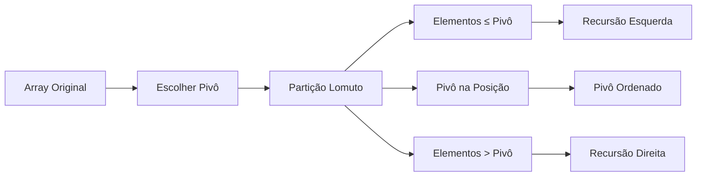

# 🚀 Quicksort - Divide & Conquer Inteligente

## 🎯 Conceito Central
**Quicksort** é um algoritmo de ordenação **divide-and-conquer** que escolhe um **pivô** e particiona o array em torno dele, recursivamente ordenando as duas metades.

## 🔧 Mecânica da Partição de Lomuto

### 📋 Pseudocódigo Essencial
```
LOMUTO-PARTITION(A, low, high):
    pivot = A[high]           # 🎯 Escolhe último elemento
    i = low - 1               # 📍 Índice para elementos menores
    
    for j = low to high - 1:  # 🔄 Percorre array
        if A[j] ≤ pivot:      # ✅ Elemento menor/igual
            i = i + 1          # 📈 Avança posição
            swap A[i] ↔ A[j]   # 🔄 Troca elementos
    
    swap A[i + 1] ↔ A[high]   # 🎯 Coloca pivô na posição final
    return i + 1               # 📍 Retorna posição do pivô
```

### 🎨 Visualização da Partição


## ⚡ Análise de Complexidade

### 📊 Tabela de Performance
| Cenário | ⏱️ Tempo | 💾 Espaço | 📈 Estabilidade |
|---------|-----------|-----------|-----------------|
| **Melhor Caso** | $O(n \log n)$ | $O(\log n)$ | ❌ Não Estável |
| **Caso Médio** | $O(n \log n)$ | $O(\log n)$ | ❌ Não Estável |
| **Pior Caso** | $O(n^2)$ | $O(n)$ | ❌ Não Estável |

### 🔍 Análise Detalhada
- **🔄 Recorrência**: $T(n) = T(k) + T(n-k-1) + O(n)$
- **🎯 Pivô Ótimo**: $k = n/2$ → $O(n \log n)$
- **⚠️ Pivô Ruim**: $k = 0$ ou $k = n-1$ → $O(n^2)$

## 🎯 Vantagens vs Desvantagens

### ✅ Vantagens
- **🚀 Rápido no caso médio**: $O(n \log n)$
- **💾 In-place**: Modifica array original
- **🎯 Cache-friendly**: Boa localidade de referência
- **🔧 Simples**: Fácil de implementar

### ❌ Desvantagens
- **⚠️ Pior caso**: $O(n^2)$ com dados já ordenados
- **🔄 Não estável**: Pode trocar elementos iguais
- **🎲 Sensível ao pivô**: Performance depende da escolha

## 🔧 Implementação Python

### 🎯 Partição de Lomuto
```python
def lomuto_partition(arr, low, high):
    pivot = arr[high]         # 🎯 Último elemento
    i = low - 1               # 📍 Posição para menores
    
    for j in range(low, high):
        if arr[j] <= pivot:   # ✅ Elemento menor/igual
            i += 1            # 📈 Avança posição
            arr[i], arr[j] = arr[j], arr[i]  # 🔄 Troca
    
    arr[i + 1], arr[high] = arr[high], arr[i + 1]  # 🎯 Pivô final
    return i + 1              # 📍 Retorna posição
```

### 🚀 Quicksort Completo
```python
def quicksort_lomuto(arr, low=None, high=None):
    if low is None:
        low = 0
    if high is None:
        high = len(arr) - 1
    
    if low < high:            # 🔄 Caso recursivo
        pivot_idx = lomuto_partition(arr, low, high)
        quicksort_lomuto(arr, low, pivot_idx - 1)    # ⬅️ Esquerda
        quicksort_lomuto(arr, pivot_idx + 1, high)   # ➡️ Direita
    
    return arr                # ✅ Array ordenado
```

## 🎲 Otimizações Práticas

### 🎯 Escolha Inteligente do Pivô
- **📊 Mediana de 3**: Escolhe mediana entre primeiro, meio e último
- **🎲 Pivô aleatório**: Evita pior caso determinístico
- **📈 Mediana de 5**: Melhor estimativa para arrays grandes

### 🔄 Tratamento de Duplicatas
- **🔄 Three-way partition**: Separa elementos iguais ao pivô
- **📊 Lomuto modificado**: Agrupa elementos iguais
- **⚡ Hoare partition**: Mais eficiente para duplicatas

## 🏆 Comparação com Outros Algoritmos

### 📊 Tabela Comparativa
| Algoritmo | ⏱️ Tempo Médio | ⏱️ Pior Caso | 💾 Espaço | 🔄 Estável |
|-----------|----------------|---------------|-----------|------------|
| **Quicksort** | $O(n \log n)$ | $O(n^2)$ | $O(\log n)$ | ❌ |
| **Merge Sort** | $O(n \log n)$ | $O(n \log n)$ | $O(n)$ | ✅ |
| **Heap Sort** | $O(n \log n)$ | $O(n \log n)$ | $O(1)$ | ❌ |
| **Tim Sort** | $O(n \log n)$ | $O(n \log n)$ | $O(n)$ | ✅ |

## 🎯 Aplicações Práticas

### 🚀 Casos de Uso Ideais
- **📊 Ordenação geral**: Quando estabilidade não importa
- **⚡ Sistemas em tempo real**: Performance média excelente
- **💾 Memória limitada**: In-place sorting
- **🎲 Dados aleatórios**: Evita pior caso

### ⚠️ Casos a Evitar
- **📈 Dados já ordenados**: Pior caso $O(n^2)$
- **🔄 Estabilidade necessária**: Use Merge Sort
- **🎯 Ordenação parcial**: Use Heap Sort

## 💡 Insights Teóricos

### 🔍 Por que Funciona?
- **🎯 Invariante**: Após partição, pivô está na posição final
- **🔄 Recursão**: Subproblemas menores garantem convergência
- **📊 Probabilidade**: Pivô aleatório evita pior caso

### 🎲 Análise Probabilística
- **📈 Caso médio**: $O(n \log n)$ com pivô aleatório
- **🎯 Esperança**: $\frac{1}{n} \sum_{i=1}^{n} (T(i-1) + T(n-i)) + O(n)$
- **📊 Resultado**: $T(n) = O(n \log n)$ em esperança

## 🚀 Evolução Histórica

### 📅 Desenvolvimento
- **1959**: Tony Hoare desenvolve Quicksort
- **1961**: Publicação em Communications of the ACM
- **1975**: Sedgewick resolve problemas de análise
- **1993**: Bentley e McIlroy otimizam para bibliotecas

### 🔧 Variações Modernas
- **🔄 Dual-pivot**: Escolhe dois pivôs
- **📊 Introspective**: Combina com Heap Sort
- **⚡ Block Quicksort**: Otimização para cache
- **🎯 Adaptive**: Escolhe algoritmo baseado nos dados 