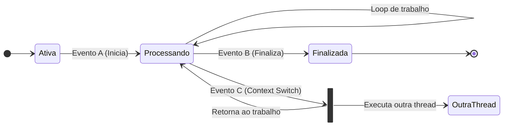
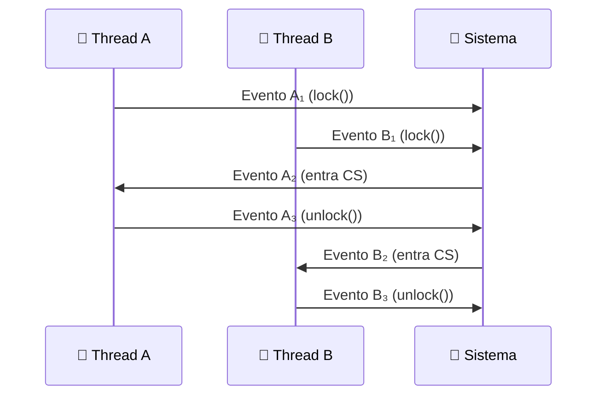

# ⏰ Tempo e Eventos

## 🎯 Conceito Central

**Tempo absoluto**: Threads compartilham tempo comum (mas não necessariamente relógio comum). Threads são máquinas de estado com transições chamadas **eventos**.

## 📊 Definições Fundamentais

### 🔄 Eventos
- **Instantâneos**: Ocorrem em instante único
- **Não simultâneos**: Eventos distintos ocorrem em tempos distintos
- **Notação**: `a_i^j` = j-ésima ocorrência do evento `a_i`
- **Precedência**: `a → b` se `a` ocorre antes de `b`

### ⏱️ Intervalos
- **Duração**: `(a₀, a₁)` = tempo entre eventos `a₀` e `a₁`
- **Precedência**: `I_A → I_B` se `a₁ → b₀`
- **Concorrência**: Intervalos não relacionados por `→`

## 🎨 Diagrama de Estados de Thread



## 🎨 Diagrama de Eventos Concorrentes



## 📋 Propriedades da Relação `→`

| Propriedade | Descrição | Símbolo |
|-------------|-----------|---------|
| **Total Order** | Eventos são totalmente ordenados | `a → b` ou `b → a` |
| **Partial Order** | Intervalos são parcialmente ordenados | `I_A → I_B` ou concorrentes |
| **Transitiva** | Se `a → b` e `b → c`, então `a → c` | `a → b → c` |

## 🔧 Aplicação Prática

- **Análise de concorrência**: Determinar ordem de execução
- **Detecção de race conditions**: Identificar acessos concorrentes
- **Prova de correção**: Demonstrar propriedades de algoritmos
- **Debugging**: Rastrear sequência de eventos

## ⚡ Exemplo: Threads A e B

```
Thread A: a₀ → a₁ → a₂ → ...
Thread B: b₀ → b₁ → b₂ → ...

Intervalos:
- I_A = (a₀, a₁)
- I_B = (b₀, b₁)

Se a₁ → b₀: I_A → I_B (sequenciais)
Se concorrentes: I_A || I_B
```