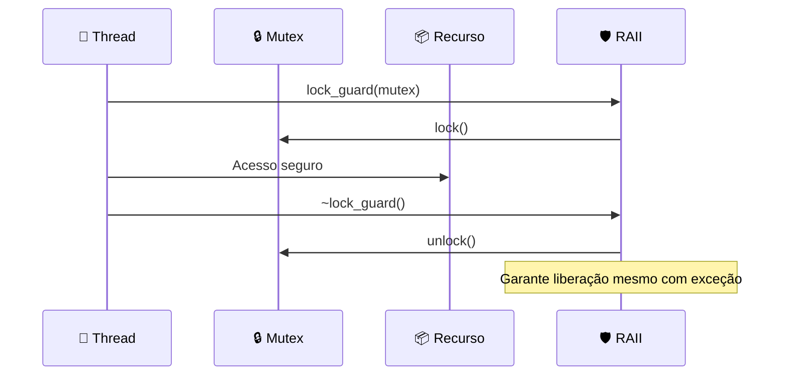
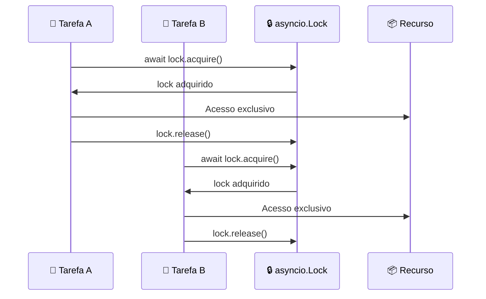
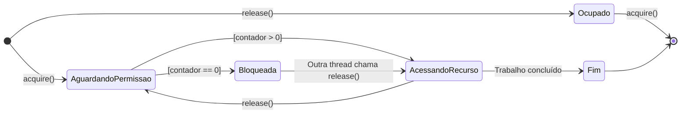
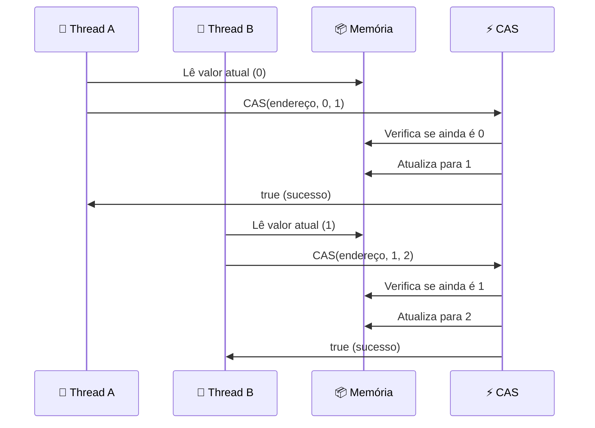
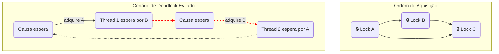

# 🔧 Mecanismos de Exclusão Mútua

## 🎯 Conceito Central

**Mecanismos práticos** para implementar exclusão mútua em linguagens de programação reais. Incluem mutexes, semáforos e operações atômicas.

## 📊 1. Mutexes (Bloqueios)

### 🔧 Implementação C++ com RAII

```cpp
#include <mutex>
#include <memory>

class SafeCounter {
private:
    std::mutex mutex_;
    long value_ = 0;
    
public:
    long getAndIncrement() {
        std::lock_guard<std::mutex> lock(mutex_);  // 🔒 RAII
        long temp = value_;
        value_ = temp + 1;
        return temp;
    }
};
```

### 🎨 Diagrama de Mutex com RAII



### 🔧 Implementação Python (asyncio)

```python
import asyncio

class AsyncSafeCounter:
    def __init__(self):
        self._lock = asyncio.Lock()
        self._value = 0
    
    async def get_and_increment(self):
        async with self._lock:  # 🔒 async with
            temp = self._value
            self._value = temp + 1
            return temp
```

### 🎨 Diagrama de asyncio.Lock



## 📊 2. Semáforos (Semáforos)

### 🎯 Conceito
**Generalização dos mutexes**: Permite que N threads acessem um recurso simultaneamente.

### 🎨 Diagrama de Semáforo como Porteiro



### 🔧 Implementação Python

```python
import asyncio

class ConnectionPool:
    def __init__(self, max_connections=5):
        self._semaphore = asyncio.Semaphore(max_connections)
        self._connections = []
    
    async def get_connection(self):
        async with self._semaphore:  # 🚦 Limita a 5 conexões
            # Simula obtenção de conexão
            connection = await self._create_connection()
            return connection
```

## 📊 3. Operações Atômicas

### 🎯 Conceito
**Operações indivisíveis** garantidas pelo hardware. Não precisam de locks explícitos.

### 🎨 Diagrama de Compare-And-Swap (CAS)



### 🔧 Implementação C++

```cpp
#include <atomic>

class AtomicCounter {
private:
    std::atomic<long> value_{0};
    
public:
    long getAndIncrement() {
        long expected = value_.load();
        while (!value_.compare_exchange_weak(expected, expected + 1)) {
            // 🔄 Tenta novamente se valor mudou
        }
        return expected;
    }
};
```

## 📊 Comparação dos Mecanismos

| Aspecto | 🔒 Mutex | 🚦 Semáforo | ⚡ Operação Atômica |
|---------|----------|-------------|-------------------|
| **Acesso** | 1 thread | N threads | Operação única |
| **Overhead** | ⏰ Alto | ⏰ Médio | 🚀 Baixo |
| **Flexibilidade** | 🟢 Alta | 🟢 Alta | ❌ Limitada |
| **Complexidade** | 🟡 Média | 🟡 Média | 🟢 Baixa |
| **Aplicação** | Seções críticas | Pool de recursos | Contadores simples |

## 🔧 Prevenção de Deadlock

### 🎨 Diagrama de Hierarquia de Bocks



### ⚡ Regra de Ouro
**Sempre adquira locks na mesma ordem predefinida**

```cpp
// ✅ Correto: Ordem consistente
std::lock_guard<std::mutex> lock1(mutex_a);
std::lock_guard<std::mutex> lock2(mutex_b);

// ❌ Incorreto: Ordem inconsistente
std::lock_guard<std::mutex> lock2(mutex_b);
std::lock_guard<std::mutex> lock1(mutex_a);
```

## 🎯 Aplicações Práticas

- **Mutexes**: Proteção de dados compartilhados
- **Semáforos**: Limitação de taxa, pool de conexões
- **Operações atômicas**: Contadores, flags, referências
- **Prevenção de deadlock**: Hierarquia de locks, timeout 