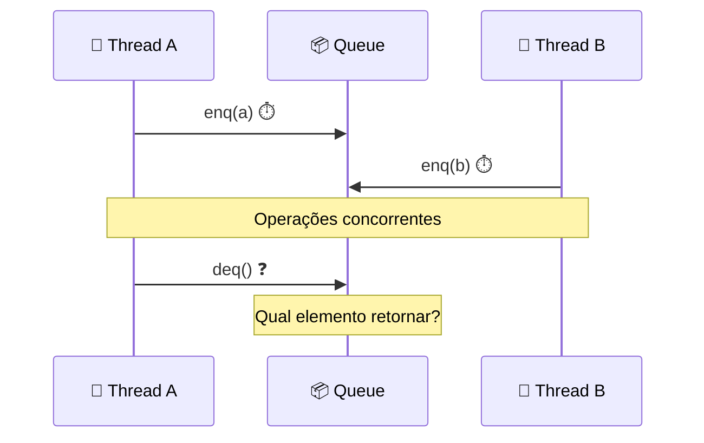

# 🔄 Conceitos Fundamentais

## 🎯 Propriedades de Segurança e Vivacidade

### 🛡️ Segurança (Safety)
- **Definição**: Nada ruim acontece
- **Exemplo**: FIFO queue nunca retorna elementos fora de ordem
- **Garantia**: Invariantes sempre preservados

### ⚡ Vivacidade (Liveness)  
- **Definição**: Algo bom eventualmente acontece
- **Exemplo**: Threads eventualmente fazem progresso
- **Tipos**: Wait-free, lock-free, obstruction-free

## 🔧 Correção vs Progresso

| Aspecto | 🎯 Correção | ⚡ Progresso |
|---------|-------------|--------------|
| **Foco** | O que é correto | Quando acontece |
| **Exemplo** | FIFO order | Thread não trava |
| **Garantia** | Invariantes | Eventual completude |

## 📦 Modelo de Objetos Sequenciais

### 🔍 Especificação Sequencial
```java
// FIFO Queue Specification
enq(x): // Pre: queue state q
        // Post: queue state q·x

deq():  // Pre: queue state a·q (non-empty)
        // Post: returns a, queue state q
```

### ⚠️ Problema da Concorrência
- **Métodos sobrepostos** no tempo
- **Estado intermediário** visível
- **Ordem ambígua** de operações

## 🎨 Diagrama: Execução Concorrente



## 🔑 Princípio Fundamental

> **Métodos devem parecer executar sequencialmente**

- **Objetivo**: Mapear execuções concorrentes para sequenciais
- **Benefício**: Raciocínio simplificado
- **Desafio**: Preservar performance 