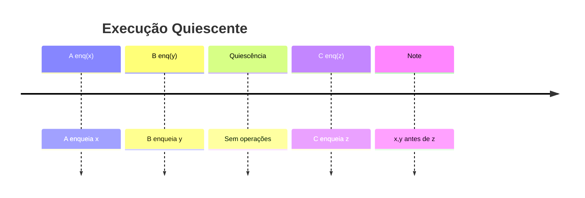
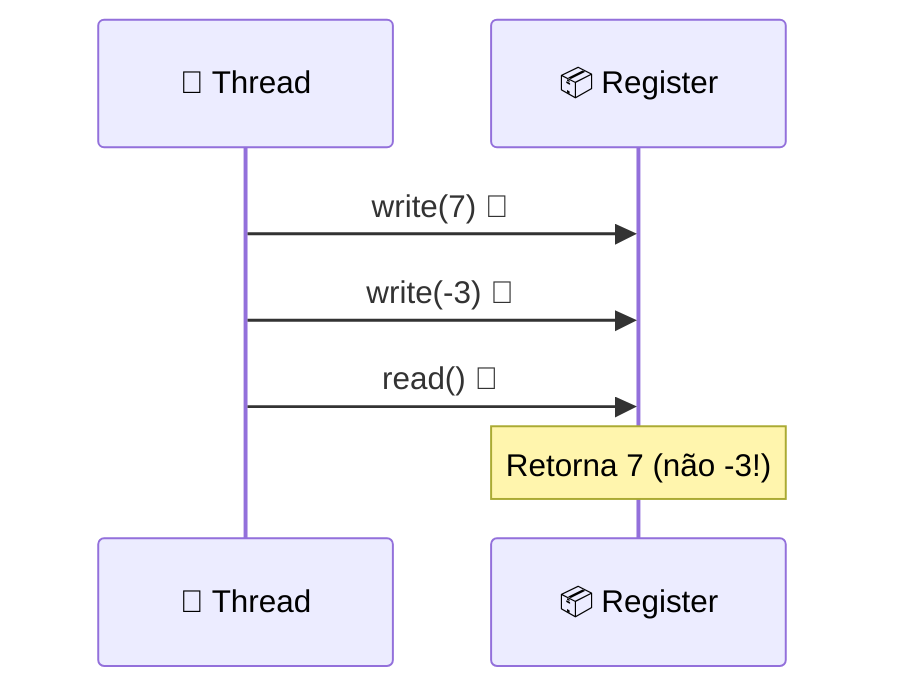
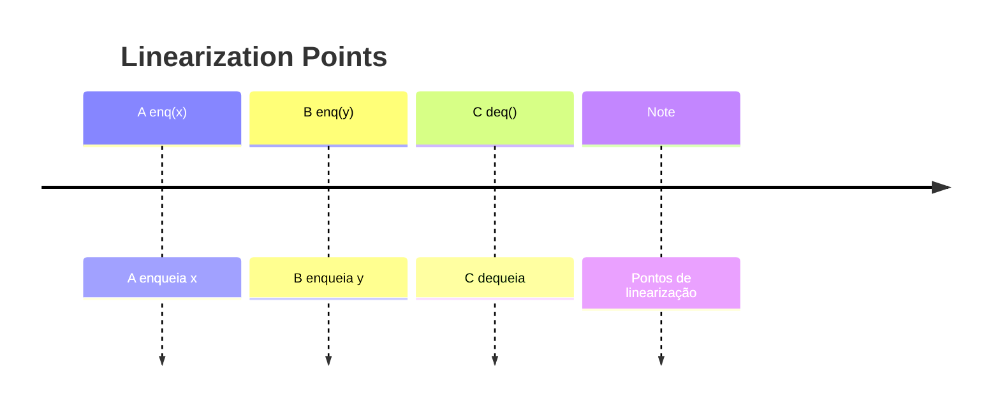

# 🎯 Condições de Correção

## 🔄 Consistência Quiescente

### 📋 Definição
- **Objeto quiescente**: Sem chamadas pendentes
- **Princípio**: Chamadas separadas por quiescência respeitam ordem temporal
- **Exemplo**: A e B enqueiam concorrentemente, C enqueia após quiescência

### ⚡ Características
| Aspecto | ✅ Vantagem | ❌ Limitação |
|---------|-------------|--------------|
| **Performance** | 🚀 Alta concorrência | 📊 Ordem fraca |
| **Composição** | 🔗 Composicional | ⚠️ Não preserva program order |
| **Bloqueio** | 🚫 Non-blocking | ❓ Ordem imprevisível |

### 🎨 Diagrama: Quiescência


## ⚡ Consistência Sequencial

### 📋 Definição
- **Program order**: Ordem de chamadas por thread
- **Princípio**: Chamadas respeitam program order
- **Exemplo**: Thread que escreve 7, depois -3, lê 7

### 🔧 Propriedades
- **Preserva program order** dentro de cada thread
- **Não preserva ordem temporal** entre threads
- **Não é composicional** ❌

### 🎨 Diagrama: Program Order


## 🎯 Linearizabilidade

### 📋 Definição
- **Linearization point**: Momento instantâneo de efeito
- **Princípio**: Cada método parece tomar efeito instantaneamente
- **Exemplo**: Lock-based queue (critical section = linearization point)

### ⭐ Características
| Aspecto | ✅ Vantagem | ❌ Custo |
|---------|-------------|----------|
| **Composição** | 🔗 Composicional | ⚡ Ordem temporal rígida |
| **Bloqueio** | 🚫 Non-blocking | 📊 Menos concorrência |
| **Raciocínio** | 🧠 Simples | 🎯 Mais restritivo |

### 🎨 Diagrama: Linearização


## 📊 Comparação das Condições

| Condição | 🎯 Força | 🔗 Composição | ⚡ Concorrência |
|----------|----------|---------------|-----------------|
| **Quiescente** | 🔄 Fraca | ✅ Sim | 🚀 Alta |
| **Sequencial** | ⚡ Média | ❌ Não | 📊 Média |
| **Linearizável** | 🎯 Forte | ✅ Sim | ⚡ Baixa |

## 🔑 Hierarquia de Força

```
Linearizabilidade ⊂ Sequential Consistency ⊂ Quiescent Consistency
```

- **Linearizabilidade**: Mais restritiva, mais útil
- **Sequencial**: Bom para sistemas standalone
- **Quiescente**: Máxima performance, ordem fraca 