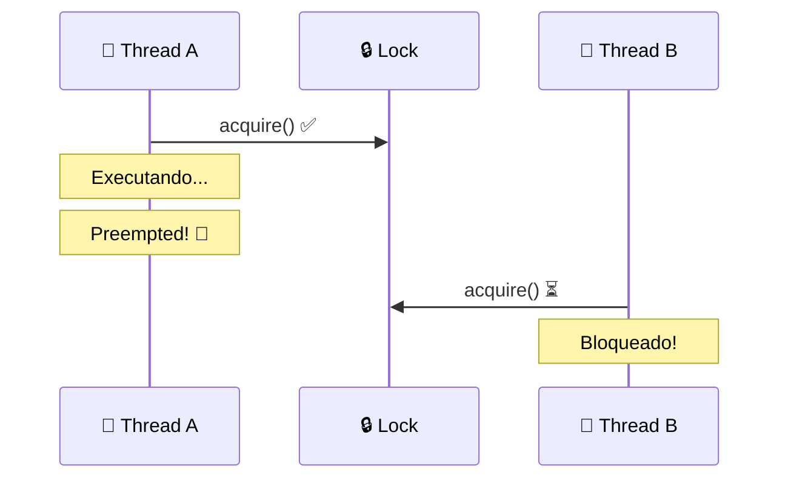
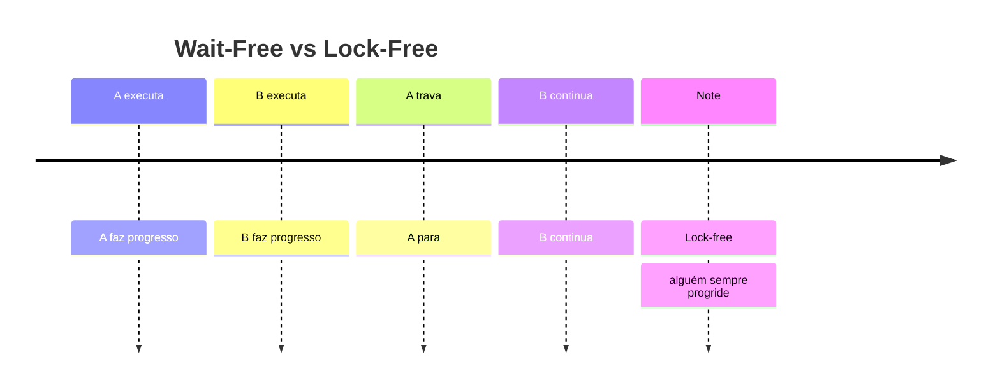

# ⚡ Condições de Progresso

## 🔒 Métodos Bloqueantes

### 📋 Definição
- **Bloqueante**: Delay de uma thread pode atrasar outras
- **Exemplo**: Lock-based queue - thread travada no lock
- **Característica**: Depende de sincronização externa

### ⚠️ Problemas
| Cenário | 🔴 Consequência | ⚡ Impacto |
|---------|-----------------|------------|
| **Cache miss** | 100 ciclos | 📊 Delay moderado |
| **Page fault** | 1M ciclos | 🐌 Delay longo |
| **Preemption** | 100M ciclos | 🚫 Bloqueio total |

### 🎨 Diagrama: Bloqueio

## 🚀 Métodos Não-Bloqueantes

### 📋 Definição
- **Não-bloqueante**: Delay de uma thread não afeta outras
- **Tipos**: Wait-free, lock-free, obstruction-free
- **Vantagem**: Progresso independente de scheduling

### ⭐ Wait-Free
- **Definição**: Todo método termina em número finito de passos
- **Bound**: Limite conhecido de passos
- **Exemplo**: Single-enqueuer/single-dequeuer queue

### 🔄 Lock-Free
- **Definição**: Infinitamente frequentemente algum método termina
- **Característica**: Progresso garantido, mas não para todos
- **Risco**: Starvation possível

### 🎯 Obstruction-Free
- **Definição**: Método termina se executar em isolamento
- **Estratégia**: Back-off quando detecta conflito
- **Uso**: Base para lock-free algorithms

## 📊 Comparação de Progresso

| Condição | 🎯 Garantia | ⚡ Performance | 🔒 Starvation |
|----------|-------------|---------------|---------------|
| **Wait-Free** | ✅ Todos terminam | 🐌 Lenta | 🚫 Impossível |
| **Lock-Free** | ⚡ Alguém termina | 📊 Média | ⚠️ Possível |
| **Obstruction-Free** | 🔄 Isolamento | 🚀 Rápida | ⚠️ Possível |
| **Blocking** | 🔒 Depende de OS | 📊 Variável | ⚠️ Possível |

## 🎨 Diagrama: Progresso Não-Bloqueante

## 🔧 Dependent vs Independent

### 🎯 Independent Progress
- **Wait-free/Lock-free**: Não dependem de scheduling
- **Garantia**: Funciona em qualquer plataforma
- **Uso**: Aplicações de tempo real

### 🔒 Dependent Progress
- **Deadlock-free/Starvation-free**: Dependem de OS
- **Requerimento**: Threads eventualmente saem de critical sections
- **Uso**: Sistemas com scheduling confiável

## 🎯 Escolha da Condição

### 📋 Fatores de Decisão
| Fator | 🚀 Wait-Free | 🔄 Lock-Free | 🔒 Blocking |
|-------|--------------|--------------|-------------|
| **Tempo Real** | ✅ Necessário | ⚡ Aceitável | ❌ Evitar |
| **Performance** | 🐌 Lenta | 📊 Média | 🚀 Rápida |
| **Simplicidade** | 🧠 Complexa | 📊 Média | ✅ Simples |
| **Plataforma** | 🌍 Qualquer | 🌍 Qualquer | 🔒 Específica |

### 🎯 Recomendações
- **Aplicações críticas**: Wait-free
- **Sistemas interativos**: Lock-free
- **Sistemas simples**: Blocking (se OS confiável) 