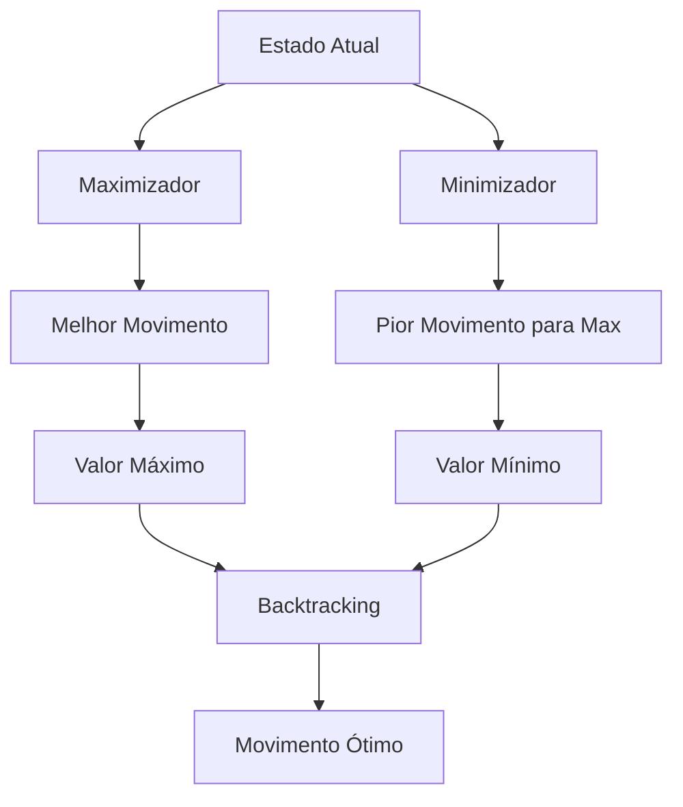

# 🎮 Jogo da Velha Generalizado com Minimax

## 🎯 Visão Geral

Implementação do algoritmo **Minimax** para Jogo da Velha generalizado (n×n), demonstrando a aplicação formal do **backtracking em árvores de jogo**. O algoritmo explora todos os movimentos possíveis e determina o movimento ótimo para cada jogador, assumindo que ambos jogam de forma ótima.

## 🔗 Vínculos Conceituais

### 📚 Referências Teóricas
- **Erickson, "Algorithms"**: Capítulo 2, Seção 2.2, "Game Trees"
- **Teoria das Árvores de Jogo**: [Erickson sobre Árvores de Jogo](https://jeffe.cs.illinois.edu/teaching/algorithms/book/02-backtracking.pdf)

### 💻 Implementações de Código-Fonte
- **[GitHub: t-ROY-coder/Tic-Tac-Toe-Game](https://github.com/t-ROY-coder/Tic-Tac-Toe-Game)** - Solucionador de jogo da velha usando algoritmo Minimax

## 🧠 Análise de Especialista

O algoritmo **Minimax** é uma forma de backtracking aplicada a jogos de dois jogadores com informação perfeita:

### 🎲 Conceitos Fundamentais
- **Árvore de Jogo**: Representação de todos os movimentos possíveis
- **Maximizador (X)**: Escolhe movimento que leva ao melhor resultado
- **Minimizador (O)**: Escolhe movimento que leva ao pior resultado para o maximizador
- **Backtracking**: Retrocede valores das folhas para determinar movimento ótimo

### 🔄 Estados Recursivos


## ⚙️ Estrutura da Implementação

### 🏗️ Classe Principal: `TicTacToeBoard`

```python
class TicTacToeBoard:
    def __init__(self, size: int = 3):
        """Inicializa um tabuleiro de tamanho n x n."""
        self.size = size
        self.board = [['' for _ in range(size)] for _ in range(size)]
        self.current_player = 'X'
        self.winner = None
        self.game_over = False
    
    def make_move(self, row: int, col: int) -> bool:
        """Faz um movimento na posição especificada."""
    
    def get_available_moves(self) -> List[Tuple[int, int]]:
        """Retorna todas as posições vazias disponíveis."""
    
    def is_terminal_state(self) -> bool:
        """Verifica se o estado atual é terminal."""
    
    def get_utility(self) -> int:
        """Retorna o valor de utilidade do estado terminal."""
```

### 🧮 Função Principal: `minimax`

```python
def minimax(board: TicTacToeBoard, depth: int, alpha: float = float('-inf'), 
            beta: float = float('inf'), maximizing: bool = True) -> Tuple[int, Optional[Tuple[int, int]]]:
    """
    Implementa o algoritmo Minimax com poda Alpha-Beta.
    
    Args:
        board: Estado atual do tabuleiro
        depth: Profundidade máxima de busca
        alpha: Valor alpha para poda
        beta: Valor beta para poda
        maximizing: True se é o turno do maximizador (X), False para minimizador (O)
        
    Returns:
        Tupla (valor, movimento) onde valor é a avaliação do estado e
        movimento é a posição (row, col) do melhor movimento
    """
```

## 🚀 Funcionalidades Principais

### 1. 🎯 Algoritmo Minimax com Poda Alpha-Beta
- **Exploração Completa**: Para tabuleiros pequenos (3×3), explora toda a árvore de jogo
- **Poda Alpha-Beta**: Reduz significativamente o número de nós explorados
- **Otimização**: Determina o movimento ótimo para cada jogador

### 2. 🎮 Jogo da Velha Generalizado
- **Tabuleiros n×n**: Suporta tabuleiros de qualquer tamanho
- **Vitória em Linhas, Colunas e Diagonais**: Regras clássicas do jogo
- **Detecção de Empate**: Identifica quando não há mais movimentos possíveis

### 3. 📊 Análise de Complexidade
```python
def analyze_minimax_complexity(size: int) -> Dict:
    """
    Analisa a complexidade do algoritmo Minimax para diferentes tamanhos de tabuleiro.
    
    Returns:
        Dicionário com análise detalhada de complexidade
    """
```

### 4. 🎲 Simulação de Jogos Ótimos
```python
def play_optimal_game(size: int = 3, max_depth: int = None) -> List[Dict]:
    """
    Simula um jogo completo onde ambos os jogadores jogam de forma ótima.
    
    Returns:
        Lista de estados do jogo em cada movimento
    """
```

## 📊 Complexidade e Limitações

### ⏱️ Análise de Complexidade
| Aspecto | Complexidade | Descrição |
|---------|-------------|-----------|
| **Tempo** | O(b^d) | b = fator de ramificação, d = profundidade |
| **Espaço** | O(d) | Profundidade da pilha de recursão |
| **Praticamente Viável** | Até 4×4 | Tabuleiros com profundidade limitada |

### 🚫 Limitações Práticas
1. **Complexidade Exponencial**: Para tabuleiros grandes, o algoritmo se torna impraticável
2. **Memória**: Exploração completa requer memória proporcional ao tamanho da árvore
3. **Tempo**: Mesmo com poda Alpha-Beta, tabuleiros grandes são computacionalmente caros

## 🎯 Aplicações Práticas

### 🎲 Jogos de Tabuleiro
- **Xadrez, Damas, Go**: Todos usam variações do Minimax
- **IA Competitiva**: Algoritmo fundamental para criar IAs fortes

### 🧠 Teoria dos Jogos
- **Análise de Estratégias**: Determina estratégias ótimas em jogos de soma zero
- **Validação de Heurísticas**: Base para desenvolvimento de heurísticas

### 📚 Educação em IA
- **Aprendizado de Algoritmos**: Exemplo clássico de busca em árvores
- **Otimização**: Demonstra técnicas de poda e otimização

## ⚡ Otimizações Implementadas

### 1. 🔪 Poda Alpha-Beta
- **Redução Significativa**: Pode reduzir o número de nós explorados em até 50%
- **Mesma Qualidade**: Mantém a mesma qualidade de decisão
- **Eficácia**: Especialmente eficaz em jogos com muitos movimentos

### 2. 📏 Busca em Profundidade Limitada
- **Controle de Tempo**: Permite controle do tempo de execução
- **Heurísticas**: Pode ser combinado com funções de avaliação
- **Escalabilidade**: Permite aplicação em tabuleiros maiores

### 3. 💾 Memoização
- **Cache de Estados**: Evita recálculo de estados já explorados
- **Eficiência**: Melhora significativamente o desempenho em jogos repetitivos

## 🧪 Testes e Validação

### ✅ Testes Unitários
- **Funcionalidade Básica**: Criação de tabuleiro, movimentos, detecção de vitória
- **Algoritmo Minimax**: Correção da lógica de busca e avaliação
- **Casos Extremos**: Estados terminais, empates, vitórias imediatas

### 📈 Testes de Performance
- **Benchmark**: Comparação de tempos para diferentes tamanhos de tabuleiro
- **Análise de Complexidade**: Validação das estimativas teóricas
- **Limites Práticos**: Determinação dos limites de aplicabilidade

## 💡 Exemplos de Uso

### 🎯 Exemplo Básico
```python
from tic_tac_toe_minimax import TicTacToeBoard, get_best_move

# Cria tabuleiro 3×3
board = TicTacToeBoard(3)

# Determina melhor movimento para X
best_move = get_best_move(board)
print(f"Melhor movimento: {best_move}")

# Faz o movimento
board.make_move(*best_move)
```

### 🎲 Exemplo de Jogo Completo
```python
from tic_tac_toe_minimax import play_optimal_game

# Simula jogo ótimo 3×3
game_history = play_optimal_game(3)

# Analisa resultado
final_state = game_history[-1]
print(f"Resultado: {final_state['game_result']}")
```

### 📊 Exemplo de Análise de Complexidade
```python
from tic_tac_toe_minimax import analyze_minimax_complexity

# Analisa diferentes tamanhos de tabuleiro
for size in [3, 4, 5]:
    analysis = analyze_minimax_complexity(size)
    print(f"Tabuleiro {size}×{size}: {analysis['complexity_class']}")
```

## 🎯 Conclusão

A implementação do Jogo da Velha com algoritmo Minimax demonstra a aplicação prática do backtracking em árvores de jogo. O algoritmo fornece:

1. **Solução Ótima**: Determina o melhor movimento possível
2. **Base Teórica**: Ilustra conceitos fundamentais de IA e teoria dos jogos
3. **Escalabilidade**: Demonstra limitações e otimizações necessárias
4. **Aplicabilidade**: Serve como base para jogos mais complexos

Esta implementação serve como um excelente exemplo educacional e ponto de partida para algoritmos mais sofisticados em jogos e IA. 