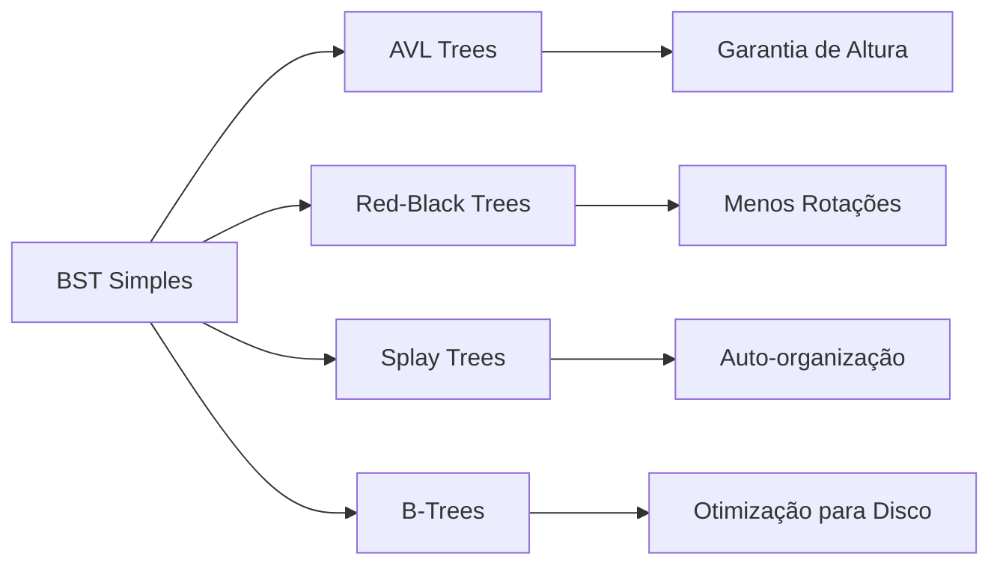

# 🌳 BST: O Ancestral Conceitual das Árvores Balanceadas

## 🎯 Contexto Histórico e Conceitual

A **Binary Search Tree (BST)** não é apenas uma estrutura de dados isolada — é o **ancestral conceitual** de todas as árvores balanceadas modernas. Sua simplicidade elegante esconde um trade-off fundamental que motivou décadas de pesquisa em estruturas auto-balanceadas.

## ⚖️ O Trade-off Central

| Aspecto | ✅ Vantagem | ❌ Desvantagem |
|---------|-------------|----------------|
| **Implementação** | 🎯 Simples e intuitiva | 🐛 Vulnerável a degeneração |
| **Conceito** | 📚 Fácil de entender | ⚠️ Pior caso O(n) |
| **Flexibilidade** | 🔄 Adaptável | 📉 Performance imprevisível |

### 🐛 A Vulnerabilidade Fundamental

**Degeneração em Lista Ligada:**
```
Inserção sequencial: 1, 2, 3, 4, 5, 6, 7

Resultado:
1
 \
  2
   \
    3
     \
      4
       \
        5
         \
          6
           \
            7
```

**Impacto:** Busca vira O(n) em vez de O(log n) 😱

## 🔍 Propriedade Fundamental: A Chave da Eficiência

### 🎯 Eliminação Binária

A propriedade BST permite **eliminar metade da árvore** a cada comparação:

```
       8
      / \
     3   10    ← Busca por 12: elimina subárvore esquerda
    / \    \
   1   6    14
      / \
     4   7
```

**Analogia:** Busca binária em array ordenado 🔍

### 📊 Complexidade das Operações

| Operação | Melhor Caso | Caso Médio | Pior Caso |
|----------|-------------|------------|-----------|
| **Busca** | O(1) | O(log n) | O(n) |
| **Inserção** | O(1) | O(log n) | O(n) |
| **Remoção** | O(1) | O(log n) | O(n) |

## 🌟 Evolução para Árvores Balanceadas

### 🔄 Linha do Tempo Conceitual



### 🎯 Motivação para Auto-balanceamento

**Problema:** BST degenerada = lista ligada
**Solução:** Regras de reorganização automática

## 🚀 Primeiros Passos Práticos

### 📝 Implementações Fundamentais

1. **`search_bst.py`** - Busca eficiente usando propriedade BST
2. **`tree_min_max.py`** - Exploração das extremidades da árvore

### 🎯 Estratégia de Implementação

**Busca BST:**
- Compare com raiz
- Elimine metade da árvore
- Recursão na subárvore apropriada

**Min/Max:**
- **Mínimo:** Siga sempre à esquerda
- **Máximo:** Siga sempre à direita

## 🔗 Conexão com Estruturas Modernas

A BST é a **base conceitual** para:
- 🔴 **Red-Black Trees** (std::map, TreeMap)
- 🌀 **AVL Trees** (balanceamento perfeito)
- 🎲 **Splay Trees** (auto-organização)
- 📚 **B-Trees** (otimização para disco)

**Lição:** Simplicidade conceitual + regras de balanceamento = estruturas robustas 