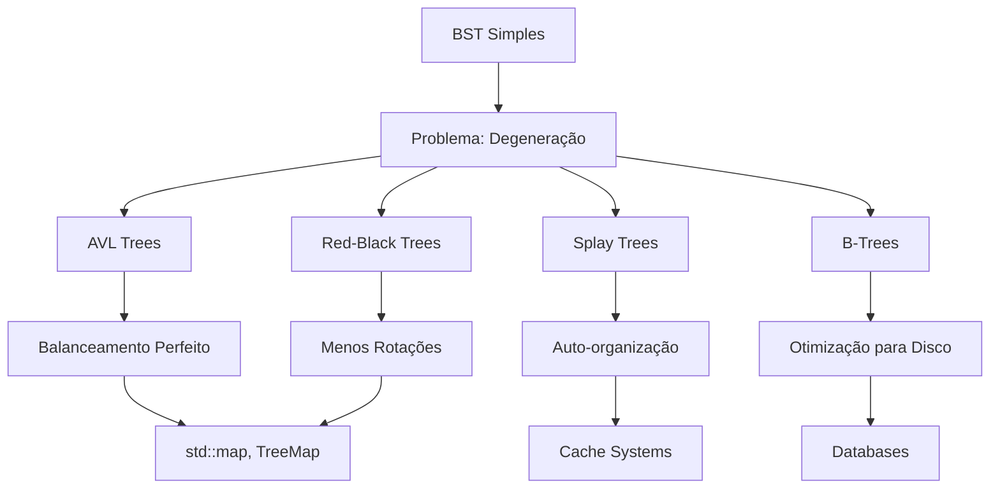

# 🔗 Resumo: BST como Ancestral Conceitual

## 🎯 Visão Geral Integrada

A **Binary Search Tree (BST)** é mais que uma estrutura isolada — é o **ancestral conceitual** que conecta todas as árvores balanceadas modernas. Sua simplicidade elegante esconde insights profundos sobre eficiência computacional.

## 🌳 Linha Evolutiva das Árvores



## ⚖️ O Trade-off Fundamental

### 🎯 Simplicidade vs Robustez

| Aspecto | BST Simples | Árvores Balanceadas |
|---------|-------------|-------------------|
| **Implementação** | 🎯 Trivial | 🔧 Complexa |
| **Conceito** | 📚 Intuitivo | 🧠 Sofisticado |
| **Performance** | ⚠️ O(n) pior caso | ✅ O(log n) garantido |
| **Manutenção** | 🔄 Manual | 🤖 Automática |

### 🐛 A Vulnerabilidade Central

**Degeneração em Lista Ligada:**
```
Inserção: 1, 2, 3, 4, 5, 6, 7

Resultado:
1
 \
  2
   \
    3
     \
      4
       \
        5
         \
          6
           \
            7
```

**Impacto:** Busca vira O(n) 😱

## 🔍 Propriedade Fundamental: A Chave

### 🎯 Eliminação Binária

A propriedade BST permite **eliminar metade da árvore** a cada comparação:

```
       8
      / \
     3   10    ← Busca por 12: elimina subárvore esquerda
    / \    \
   1   6    14
      / \
     4   7
```

**Analogia:** Busca binária em array ordenado 🔍

### 📊 Complexidade das Operações

| Operação | Melhor Caso | Caso Médio | Pior Caso |
|----------|-------------|------------|-----------|
| **Busca** | O(1) | O(log n) | O(n) |
| **Inserção** | O(1) | O(log n) | O(n) |
| **Remoção** | O(1) | O(log n) | O(n) |

## 🚀 Implementações Práticas

### 📝 Primeiros Passos

1. **`search_bst.py`** - Demonstra eliminação binária
2. **`tree_min_max.py`** - Explora extremidades da árvore

### 🎯 Estratégias de Implementação

**Busca BST:**
- Compare com raiz
- Elimine metade da árvore
- Recursão na subárvore apropriada

**Min/Max:**
- **Mínimo:** Siga sempre à esquerda
- **Máximo:** Siga sempre à direita

## 🔗 Conexões com Estruturas Modernas

### 🌟 Red-Black Trees
- **Base:** Propriedade BST
- **Adição:** Regras de cores
- **Resultado:** Menos rotações que AVL
- **Uso:** `std::map`, `TreeMap`

### 🌀 AVL Trees
- **Base:** Propriedade BST
- **Adição:** Fator de balanceamento
- **Resultado:** Altura mínima garantida
- **Uso:** Quando balanceamento perfeito é crítico

### 🎲 Splay Trees
- **Base:** Propriedade BST
- **Adição:** Auto-organização
- **Resultado:** Otimização para acesso frequente
- **Uso:** Sistemas de cache

### 📚 B-Trees
- **Base:** Propriedade BST
- **Adição:** Múltiplos filhos por nó
- **Resultado:** Otimização para disco
- **Uso:** Bancos de dados

## 💡 Lições Fundamentais

### 🎯 1. Simplicidade Conceitual
A BST demonstra que **conceitos simples** podem ter **poder computacional** extraordinário.

### 🔄 2. Trade-offs Inevitáveis
**Simplicidade** vs **Robustez** é um trade-off fundamental em estruturas de dados.

### 🌟 3. Evolução Incremental
Estruturas complexas são **evoluções** de conceitos simples, não substituições.

### 📚 4. Propriedades Invariantes
A **propriedade BST** é a invariante que garante eficiência em todas as operações.

## 🚀 Próximos Passos Conceituais

### 📖 Árvores AVL
- Entender **fator de balanceamento**
- Aprender **rotações** simples e duplas
- Ver como **altura mínima** é garantida

### 🔴 Red-Black Trees
- Compreender **regras de cores**
- Analisar **casos de inserção/remoção**
- Ver por que **menos rotações** que AVL

### 🎲 Splay Trees
- Entender **auto-organização**
- Ver como **acesso frequente** é otimizado
- Analisar **amortização** de custos

### 📚 B-Trees
- Compreender **otimização para disco**
- Ver como **múltiplos filhos** reduzem altura
- Entender **sistemas de arquivos**

## 🎯 Conclusão

A BST é o **ancestral conceitual** que conecta todas as árvores balanceadas modernas. Sua simplicidade elegante esconde insights profundos sobre:

- **Eficiência computacional** através de eliminação binária
- **Trade-offs fundamentais** entre simplicidade e robustez
- **Evolução incremental** de estruturas de dados
- **Propriedades invariantes** que garantem correção

**Lição Final:** Entender a BST é entender a **base conceitual** de todas as árvores balanceadas modernas. 