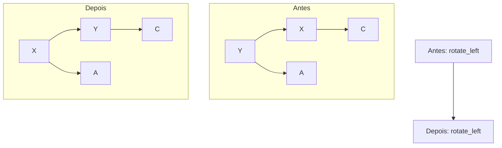
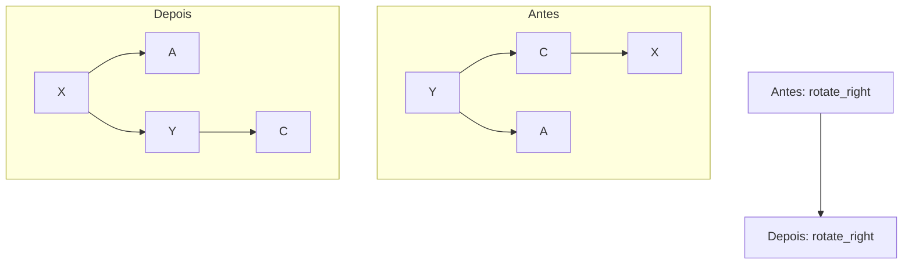
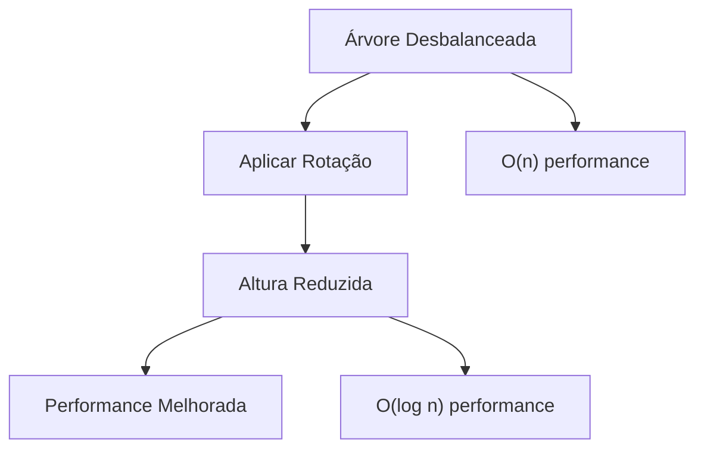
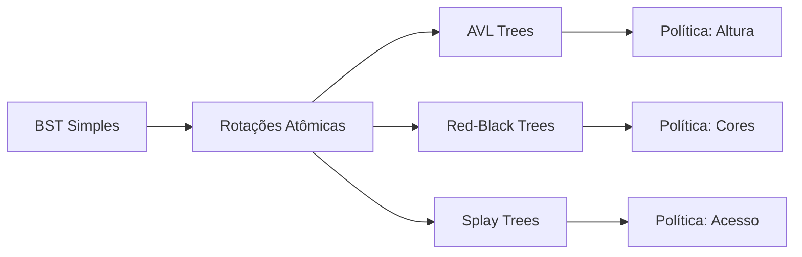

# 🔄 Mecânica Rotacional: Operações Atômicas do Auto-Balanceamento

## 🎯 O que são Rotações?

As **rotações** são **operações atômicas** que permitem reestruturar uma árvore binária para reduzir sua altura, **preservando a propriedade fundamental da BST**. Elas são a **base mecânica** de todas as árvores auto-balanceadas.

### 🔍 Por que são Necessárias?

**Problema:** BST degenerada = lista ligada = O(n) performance
**Solução:** Rotações = reestruturação = altura logarítmica

## ⚡ Operações Atômicas Fundamentais

### 🔄 Rotação à Esquerda (`rotate_left`)

**Objetivo:** Reduzir altura da subárvore direita



**Transformação:**
```
    Y           X
   / \         / \
  X   C  →    A   Y
 / \             / \
A   B           B   C
```

### 🔄 Rotação à Direita (`rotate_right`)

**Objetivo:** Reduzir altura da subárvore esquerda



**Transformação:**
```
    Y           X
   / \         / \
  X   C  →    A   Y
 / \             / \
A   B           B   C
```

## 🛡️ Preservação da Propriedade BST

### ✅ Invariante Mantida

**Antes da rotação:**
- A < X < B < Y < C

**Depois da rotação:**
- A < X < B < Y < C

**Resultado:** Propriedade BST preservada! 🎯

### 🔍 Verificação Visual

```
Antes:     Y           Depois:    X
          / \                    / \
         X   C                  A   Y
        / \                        / \
       A   B                      B   C

Ordem in-order: A → X → B → Y → C  (preservada!)
```

## ⚙️ Mecânica das Operações

### 🔧 Algoritmo: Rotação à Esquerda

```python
def rotate_left(root):
    # 1. Identificar novo nó raiz
    new_root = root.right
    
    # 2. Reorganizar ponteiros
    root.right = new_root.left
    new_root.left = root
    
    # 3. Retornar nova raiz
    return new_root
```

### 🔧 Algoritmo: Rotação à Direita

```python
def rotate_right(root):
    # 1. Identificar novo nó raiz
    new_root = root.left
    
    # 2. Reorganizar ponteiros
    root.left = new_root.right
    new_root.right = root
    
    # 3. Retornar nova raiz
    return new_root
```

## 📊 Análise de Complexidade

| Aspecto | Complexidade | Explicação |
|---------|--------------|------------|
| **Tempo** | O(1) | Operação atômica |
| **Espaço** | O(1) | Apenas reorganização de ponteiros |
| **Propriedade BST** | ✅ Preservada | Invariante mantida |

## 🎯 Casos de Uso

### 🔄 **Redução de Altura**



### 🔄 **Reestruturação Local**

- **Escopo:** Apenas 3 nós envolvidos
- **Impacto:** Resto da árvore inalterado
- **Eficiência:** Operação local e rápida

## 🔗 Conexão com Auto-Balanceamento

### 🎯 Políticas de Aplicação

| Estrutura | Quando Aplicar | Como Aplicar |
|-----------|----------------|--------------|
| **AVL Trees** | Fator > 1 ou < -1 | Rotações simples/duplas |
| **Red-Black** | Violação de regras | Rotações + recolorização |
| **Splay Trees** | Acesso a nó | Rotações para topo |

### 🔄 Diferentes Políticas, Mesmas Operações



## 💡 Insights Fundamentais

### 🎯 1. Operações Atômicas
Rotações são **indivisíveis** - ou acontecem completamente ou não acontecem.

### 🔄 2. Preservação de Propriedades
A propriedade BST é **invariante** - mantida antes e depois da rotação.

### ⚡ 3. Eficiência Local
Rotações afetam apenas **3 nós** - operação extremamente eficiente.

### 🎯 4. Universalidade
**Mesmas operações** usadas por diferentes esquemas de balanceamento.

## 🚀 Próximos Passos

### 📝 **Implementação Prática**
- `rotate_left.py` - Operação atômica fundamental
- `rotate_right.py` - Operação atômica fundamental

### 🔗 **Conexões Conceituais**
- **AVL Trees** - Rotações baseadas em fator de balanceamento
- **Red-Black Trees** - Rotações baseadas em regras de cores
- **Splay Trees** - Rotações para otimização de acesso

**Lição:** As rotações são as **operações atômicas** que transformam BSTs simples em estruturas auto-balanceadas robustas! 