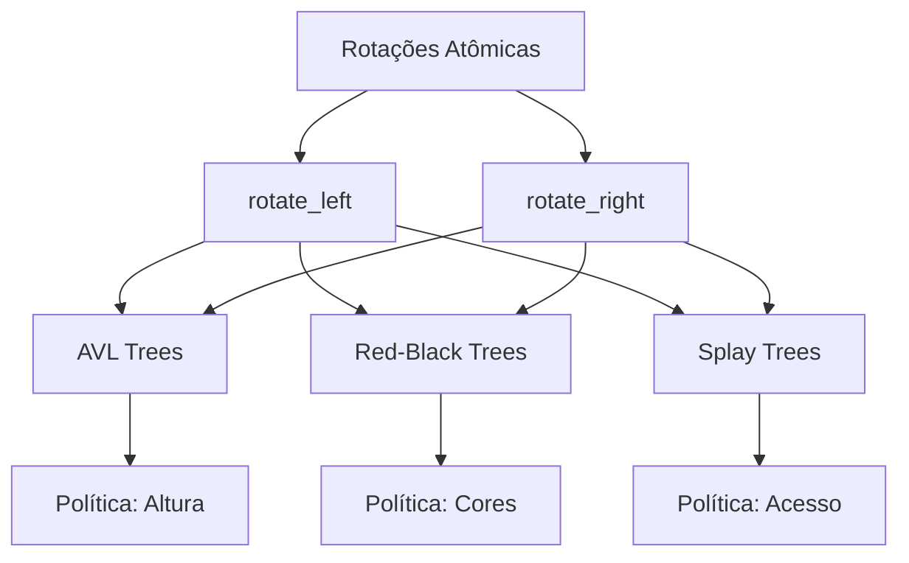

# 🔗 Conexões com Auto-Balanceamento: Políticas de Aplicação

## 🎯 Visão Geral

As **rotações atômicas** são a **base mecânica** de todas as árvores auto-balanceadas. Diferentes esquemas de balanceamento (AVL, Red-Black, Splay) são, em essência, **diferentes políticas** que ditam quando e como aplicar estas mesmas operações atômicas.

## 🔄 Diferentes Políticas, Mesmas Operações

### 🎯 Políticas de Aplicação

| Estrutura | Quando Aplicar | Como Aplicar | Objetivo |
|-----------|----------------|--------------|----------|
| **AVL Trees** | Fator > 1 ou < -1 | Rotações simples/duplas | Altura mínima |
| **Red-Black** | Violação de regras | Rotações + recolorização | Menos rotações |
| **Splay Trees** | Acesso a nó | Rotações para topo | Otimização de acesso |

### 🔄 Operações Atômicas Universais



## 🌟 Árvores AVL: Política de Altura

### 🎯 Quando Aplicar Rotações

**Critério:** Fator de balanceamento fora do intervalo [-1, 1]

```python
def balance_factor(node):
    return height(node.left) - height(node.right)

# Aplicar rotação quando:
# balance_factor > 1  (desbalanceada à esquerda)
# balance_factor < -1 (desbalanceada à direita)
```

### 🔄 Casos de Rotação AVL

#### 📊 Caso 1: Left-Left (LL)
```
    Z (fator = 2)
   /
  Y (fator = 1)
 /
X

Solução: rotate_right(Z)
```

#### 📊 Caso 2: Right-Right (RR)
```
Z (fator = -2)
 \
  Y (fator = -1)
   \
    X

Solução: rotate_left(Z)
```

#### 📊 Caso 3: Left-Right (LR)
```
    Z (fator = 2)
   /
  Y (fator = -1)
   \
    X

Solução: rotate_left(Y) + rotate_right(Z)
```

#### 📊 Caso 4: Right-Left (RL)
```
Z (fator = -2)
 \
  Y (fator = 1)
 /
X

Solução: rotate_right(Y) + rotate_left(Z)
```

### ⚡ Complexidade AVL

| Operação | Complexidade | Explicação |
|----------|--------------|------------|
| **Inserção** | O(log n) | Máximo 2 rotações |
| **Remoção** | O(log n) | Máximo O(log n) rotações |
| **Busca** | O(log n) | Altura garantida |

## 🔴 Red-Black Trees: Política de Cores

### 🎯 Quando Aplicar Rotações

**Critério:** Violação das regras de cores Red-Black

**Regras Red-Black:**
1. Nó raiz é preto
2. Nós vermelhos não podem ter filhos vermelhos
3. Caminhos da raiz às folhas têm mesmo número de nós pretos

### 🔄 Casos de Rotação Red-Black

#### 📊 Caso 1: Tio Vermelho
```
    P (preto)
   / \
  V   T (vermelho)
 / \
N   N

Solução: Recolorização (sem rotação)
```

#### 📊 Caso 2: Tio Preto - Triângulo
```
    P (preto)
   /
  V (vermelho)
   \
    N (vermelho)

Solução: rotate_left(V) + rotate_right(P)
```

#### 📊 Caso 3: Tio Preto - Linha
```
    P (preto)
   /
  V (vermelho)
 /
N (vermelho)

Solução: rotate_right(P) + recolorização
```

### ⚡ Complexidade Red-Black

| Operação | Complexidade | Explicação |
|----------|--------------|------------|
| **Inserção** | O(log n) | Máximo 3 rotações |
| **Remoção** | O(log n) | Máximo 3 rotações |
| **Busca** | O(log n) | Altura ≤ 2*log(n+1) |

## 🎲 Splay Trees: Política de Acesso

### 🎯 Quando Aplicar Rotações

**Critério:** Acesso a qualquer nó

**Objetivo:** Mover nó acessado para a raiz

### 🔄 Casos de Rotação Splay

#### 📊 Zig (nó é filho da raiz)
```
    P
   /
  N

Solução: rotate_right(P)
```

#### 📊 Zig-Zig (nó é neto da raiz)
```
    G
   /
  P
 /
N

Solução: rotate_right(G) + rotate_right(P)
```

#### 📊 Zig-Zag (nó é neto da raiz)
```
    G
   /
  P
   \
    N

Solução: rotate_left(P) + rotate_right(G)
```

### ⚡ Complexidade Splay

| Operação | Complexidade | Explicação |
|----------|--------------|------------|
| **Acesso** | O(log n) amortizado | Rotações para topo |
| **Inserção** | O(log n) amortizado | Splay + inserção |
| **Remoção** | O(log n) amortizado | Splay + remoção |

## 📊 Comparação de Políticas

### 🎯 Trade-offs entre Esquemas

| Aspecto | AVL Trees | Red-Black Trees | Splay Trees |
|---------|-----------|-----------------|-------------|
| **Altura** | ✅ Mínima | ⚠️ ≤ 2*log(n+1) | ❌ Variável |
| **Rotações** | ❌ Muitas | ✅ Poucas | ⚠️ Muitas |
| **Implementação** | 🔧 Complexa | 🔧 Complexa | 🎯 Simples |
| **Performance** | ✅ Consistente | ✅ Consistente | ⚠️ Amortizada |
| **Otimização** | ❌ Nenhuma | ❌ Nenhuma | ✅ Acesso frequente |

### 🔄 Frequência de Rotações

```mermaid
graph LR
    A[Inserção] --> B[AVL: 2 rotações]
    A --> C[Red-Black: 3 rotações]
    A --> D[Splay: O(log n) rotações]
    
    E[Busca] --> F[AVL: 0 rotações]
    E --> G[Red-Black: 0 rotações]
    E --> H[Splay: O(log n) rotações]
```

## 💡 Insights Fundamentais

### 🎯 1. Universalidade das Operações
**Mesmas rotações atômicas** usadas por diferentes políticas de balanceamento.

### 🔄 2. Políticas Determinam Frequência
**Quando** aplicar rotações é mais importante que **como** aplicá-las.

### ⚡ 3. Trade-offs Inevitáveis
**Altura mínima** vs **menos rotações** vs **otimização de acesso**.

### 🎯 4. Implementação Consistente
Rotações são **operações atômicas** que podem ser reutilizadas.

## 🚀 Implementações Práticas

### 📝 **Desafios Relacionados**

#### 🔄 **Rotações Básicas**
- `rotate_left.py` - Operação atômica fundamental
- `rotate_right.py` - Operação atômica fundamental

#### 🌟 **AVL Trees**
- `insert_avl.py` - Inserção com balanceamento AVL
- `is_avl_tree.py` - Verificação de propriedades AVL

#### 🔴 **Red-Black Trees**
- `insert_red_black.py` - Inserção com balanceamento Red-Black
- `is_valid_red_black.py` - Verificação de propriedades Red-Black

## 🎯 Conclusão

As **rotações atômicas** são a **base mecânica universal** que conecta todas as árvores auto-balanceadas:

- ✅ **AVL Trees** usam rotações para **altura mínima**
- ✅ **Red-Black Trees** usam rotações para **menos operações**
- ✅ **Splay Trees** usam rotações para **otimização de acesso**

**Lição:** Diferentes políticas de balanceamento são **diferentes estratégias** para aplicar as **mesmas operações atômicas** fundamentais. 