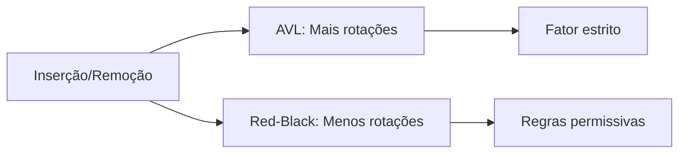

# ⚖️ Trade-offs Fundamentais: Read vs Write

## 🎯 O Clássico Dilema de Engenharia

A escolha entre **Árvores AVL** e **Red-Black Trees** representa um **clássico trade-off de engenharia** entre cargas de trabalho com uso intensivo de leitura (read-heavy) e de escrita (write-heavy).

### 🔍 Por que Diferentes Árvores Coexistem?

**Resposta:** Diferentes cargas de trabalho têm diferentes prioridades de performance.

## 📊 Comparação Direta

### 🌟 **AVL Trees - Read-Heavy**

| Aspecto | Característica | Implicação |
|---------|----------------|------------|
| **Balanceamento** | Rigidamente balanceada | Altura mínima garantida |
| **Fator** | |h(left) - h(right)| ≤ 1 | Busca mais rápida |
| **Rotações** | Frequentes | Inserção/remoção mais lenta |
| **Altura** | log₂(n) ≤ h ≤ 1.44×log₂(n+2) | Performance de busca ótima |

### 🔴 **Red-Black Trees - Write-Heavy**

| Aspecto | Característica | Implicação |
|---------|----------------|------------|
| **Balanceamento** | Permissivamente balanceada | Altura limitada mas não mínima |
| **Regras** | Cores + altura limitada | Menos rotações necessárias |
| **Rotações** | Menos frequentes | Inserção/remoção mais rápida |
| **Altura** | h ≤ 2×log₂(n+1) | Busca ligeiramente mais lenta |

## ⚡ Análise de Performance

### 📈 **Operações de Leitura (Busca)**

```mermaid
graph LR
    A[Busca] --> B[AVL: O(log n) mais rápido]
    A --> C[Red-Black: O(log n) ligeiramente mais lento]
    
    B --> D[Altura mínima]
    C --> E[Altura limitada]
```

**Vencedor:** AVL Trees ✅

**Razão:** Altura mínima = menos comparações = busca mais rápida

### 📝 **Operações de Escrita (Inserção/Remoção)**



**Vencedor:** Red-Black Trees ✅

**Razão:** Menos rotações = operações mais rápidas

## 🔄 Trade-off Central: Altura vs Rotações

### 🎯 **AVL Trees: Altura Mínima**

**Propriedade:** Fator de balanceamento estritamente em {-1, 0, 1}

**Vantagem:** Altura mínima = busca mais rápida
**Desvantagem:** Rotações frequentes = inserção/remoção mais lenta

### 🔴 **Red-Black Trees: Menos Rotações**

**Propriedade:** Altura limitada mas não mínima

**Vantagem:** Menos rotações = inserção/remoção mais rápida
**Desvantagem:** Altura maior = busca ligeiramente mais lenta

## 📊 Casos de Uso Ideais

### 🌟 **AVL Trees - Read-Heavy**

**Características da Carga:**
- Muitas buscas, poucas modificações
- Dados relativamente estáticos
- Performance de busca crítica

**Aplicações Típicas:**
- **Dicionários** construídos uma vez e consultados muitas vezes
- **Sistemas de cache** com poucas modificações
- **Índices de banco de dados** estáticos
- **Bibliotecas de dados** onde busca é prioridade

### 🔴 **Red-Black Trees - Write-Heavy**

**Características da Carga:**
- Muitas inserções/remoções
- Dados dinâmicos
- Performance de modificação crítica

**Aplicações Típicas:**
- **Agendadores de tarefas** com inserções/remoções frequentes
- **Bancos de dados em memória** dinâmicos
- **Sistemas de eventos** com alta frequência de modificações
- **Estruturas de dados** em aplicações interativas

## 🔍 Análise Quantitativa

### 📊 **Frequência de Rotações**

| Operação | AVL Trees | Red-Black Trees |
|----------|-----------|-----------------|
| **Inserção** | Máximo 2 rotações | Máximo 3 rotações |
| **Remoção** | O(log n) rotações | Máximo 3 rotações |
| **Busca** | 0 rotações | 0 rotações |

### 📈 **Altura das Árvores**

| Métrica | AVL Trees | Red-Black Trees |
|---------|-----------|-----------------|
| **Altura Mínima** | log₂(n) | log₂(n) |
| **Altura Máxima** | 1.44×log₂(n+2) | 2×log₂(n+1) |
| **Fator de Crescimento** | 1.44 | 2.0 |

## 💡 Insights Fundamentais

### 🎯 1. Não Existe "Melhor" Universal
A escolha depende da **carga de trabalho específica**.

### 🔄 2. Trade-off Inevitável
**Altura mínima** vs **menos rotações** é um trade-off fundamental.

### ⚡ 3. Performance Contextual
**Read-heavy** favorece AVL, **write-heavy** favorece Red-Black.

### 🎯 4. Implementação nas Bibliotecas
- **C++ std::map**: Red-Black Trees (write-heavy)
- **Java TreeMap**: Red-Black Trees (write-heavy)
- **Python sortedcontainers**: Red-Black Trees (write-heavy)

## 🚀 Decisão de Arquitetura

### 🎯 **Perguntas para Escolha**

1. **Qual é mais frequente:** Busca ou modificação?
2. **Qual é mais crítica:** Performance de leitura ou escrita?
3. **Como os dados evoluem:** Estáticos ou dinâmicos?
4. **Qual é o gargalo:** CPU ou memória?

### 📊 **Matriz de Decisão**

| Carga de Trabalho | Busca Frequente | Modificação Frequente | Escolha |
|-------------------|-----------------|----------------------|---------|
| **Read-Heavy** | ✅ Sim | ❌ Não | **AVL Trees** |
| **Write-Heavy** | ❌ Não | ✅ Sim | **Red-Black Trees** |
| **Balanced** | ⚖️ Moderado | ⚖️ Moderado | **Red-Black Trees** |

## 🎯 Conclusão

A coexistência de **AVL** e **Red-Black Trees** não é acidental - é uma resposta elegante ao **trade-off fundamental** entre:

- **Altura mínima** (busca rápida) vs **menos rotações** (modificação rápida)
- **Read-heavy** vs **write-heavy** cargas de trabalho
- **Performance de leitura** vs **performance de escrita**

**Lição:** A escolha entre estruturas de dados é uma **decisão de arquitetura** baseada na **carga de trabalho específica**, não em qual é "melhor" universalmente. 