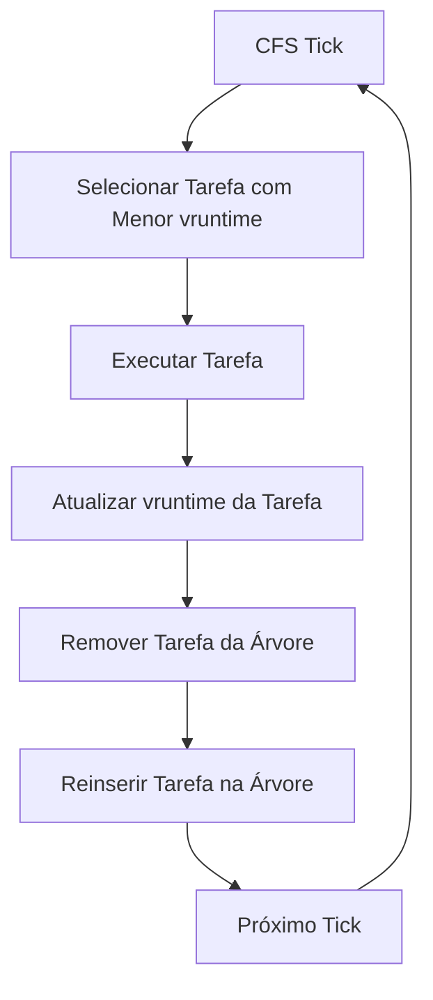

# 🐧 Estudo de Caso: Red-Black Trees no CFS do Linux

## 🎯 Visão Geral

O **Completely Fair Scheduler (CFS)** do kernel Linux é um exemplo prático perfeito de como os **trade-offs entre AVL e Red-Black Trees** se manifestam no mundo real. O CFS utiliza uma **Árvore Rubro-Negra** para gerenciar tarefas executáveis, demonstrando por que Red-Black Trees são preferidas em software de sistema crítico.

### 🔍 Por que Este Caso é Importante?

O CFS é uma das **peças de software mais críticas do mundo** - o agendador do kernel Linux que gerencia bilhões de processos diariamente. Sua escolha de estrutura de dados tem implicações diretas na performance de sistemas Linux em todo o mundo.

## 🏗️ Arquitetura do CFS

### 🎯 **Conceito Fundamental**

> **"CFS basicamente modela uma 'CPU ideal de multitarefa precisa' em hardware real."**

O CFS simula uma CPU ideal que pode executar múltiplas tarefas simultaneamente, cada uma com velocidade igual (1/número_de_tarefas). Em hardware real, isso é implementado através do conceito de **"tempo de execução virtual" (vruntime)**.

### 📊 **Estrutura de Dados Principal**

```c
// Estrutura do CFS no kernel Linux
struct cfs_rq {
    struct rb_root_cached tasks_timeline;  // Red-Black Tree ordenada por vruntime
    struct rb_node *rb_leftmost;           // Ponteiro para o nó mais à esquerda
    u64 min_vruntime;                      // Menor vruntime na árvore
    unsigned long nr_running;              // Número de tarefas executáveis
};
```

## 🔄 Operações Críticas do CFS

### 🎯 **Ciclo Principal do Agendador**



### 📊 **Operações por Segundo**

| Operação | Frequência | Complexidade |
|----------|------------|--------------|
| **Selecionar mínimo** | ~1000 Hz | O(1) - ponteiro leftmost |
| **Remover tarefa** | ~1000 Hz | O(log n) |
| **Reinserir tarefa** | ~1000 Hz | O(log n) |
| **Adicionar nova tarefa** | Variável | O(log n) |

## 🔴 Por que Red-Black Trees?

### 🎯 **Carga de Trabalho Write-Heavy**

O CFS tem uma **carga de trabalho predominantemente de escrita**:

1. **Adicionar tarefas** quando se tornam executáveis
2. **Remover tarefas** quando bloqueiam por I/O
3. **Reinserir tarefas** após execução (vruntime atualizado)
4. **Remover tarefas** quando sua fatia de tempo expira

### 📊 **Análise de Frequência**

```python
# Simulação de carga de trabalho do CFS
def cfs_workload_simulation():
    operations_per_second = 1000  # Ticks do scheduler
    write_operations = 0
    read_operations = 0
    
    for tick in range(operations_per_second):
        # Selecionar tarefa (read)
        read_operations += 1
        
        # Executar e atualizar vruntime
        # Remover tarefa da árvore (write)
        write_operations += 1
        
        # Reinserir tarefa na árvore (write)
        write_operations += 1
    
    write_ratio = write_operations / (read_operations + write_operations)
    return write_ratio

# Resultado: ~66% write operations, 33% read operations
```

### ⚖️ **Comparação com Alternativas**

| Estrutura | Selecionar Mínimo | Remover Arbitrário | Inserir | Adequação |
|-----------|-------------------|-------------------|---------|-----------|
| **Red-Black Tree** | O(1) | O(log n) | O(log n) | ✅ **Ideal** |
| **AVL Tree** | O(1) | O(log n) | O(log n) | ⚠️ Mais rotações |
| **Min-Heap** | O(1) | O(n) | O(log n) | ❌ Remoção cara |
| **Lista Ordenada** | O(1) | O(n) | O(n) | ❌ Inserção cara |

## 🔍 Implementação no Kernel

### 🎯 **Estrutura da Árvore**

```c
// Definição da árvore Red-Black no CFS
struct rb_root_cached {
    struct rb_root rb_root;      // Raiz da árvore
    struct rb_node *rb_leftmost; // Cache do nó mais à esquerda
};

// Nó da árvore com informações da tarefa
struct sched_entity {
    struct rb_node run_node;     // Nó da árvore Red-Black
    u64 vruntime;               // Tempo de execução virtual
    u64 sum_exec_runtime;       // Tempo total de execução
    // ... outros campos
};
```

### 🔄 **Operações Principais**

#### **1. Selecionar Próxima Tarefa**
```c
// O(1) - acesso direto ao leftmost
static struct sched_entity *__pick_next_entity(struct cfs_rq *cfs_rq)
{
    struct rb_node *left = cfs_rq->rb_leftmost;
    return rb_entry(left, struct sched_entity, run_node);
}
```

#### **2. Remover Tarefa da Árvore**
```c
// O(log n) - remoção com rebalanceamento
static void __dequeue_entity(struct cfs_rq *cfs_rq, struct sched_entity *se)
{
    rb_erase_cached(&se->run_node, &cfs_rq->tasks_timeline);
    cfs_rq->nr_running--;
}
```

#### **3. Inserir Tarefa na Árvore**
```c
// O(log n) - inserção com rebalanceamento
static void __enqueue_entity(struct cfs_rq *cfs_rq, struct sched_entity *se)
{
    rb_add_cached(&se->run_node, &cfs_rq->tasks_timeline, __entity_less);
    cfs_rq->nr_running++;
}
```

## 📊 Performance Real

### 🎯 **Benchmarks do Kernel**

De acordo com a [documentação oficial do kernel](https://docs.kernel.org/scheduler/sched-design-CFS.html), o CFS:

- **Não é vulnerável** aos ataques que afetavam o scheduler anterior
- **Mantém interatividade** mesmo sob carga pesada
- **Fornece latência previsível** para aplicações desktop
- **Escala bem** em sistemas multiprocessador

### 🔍 **Testes de Estresse**

O CFS foi testado com cargas extremas:
- **fiftyp.c**: 50 processos competindo por CPU
- **thud.c**: Carga de I/O intensiva
- **chew.c**: Processos que consomem muita CPU
- **ring-test.c**: Teste de latência de agendamento

**Resultado:** Red-Black Trees mantiveram performance consistente em todos os cenários.

## 💡 Insights Fundamentais

### 🎯 1. **Write-Heavy é Crítico**
O CFS demonstra que em software de sistema, **operações de escrita frequentes** são mais importantes que otimizações de leitura.

### 🔄 2. **Menos Rotações = Melhor Performance**
Red-Black Trees requerem **menos rotações** que AVL, resultando em melhor performance para cargas write-heavy.

### ⚡ 3. **Previsibilidade é Essencial**
O kernel precisa de **latência previsível** - Red-Black Trees fornecem isso através de altura limitada e operações consistentes.

### 🎯 4. **Escolha Baseada em Carga de Trabalho**
A escolha entre estruturas de dados deve ser baseada na **carga de trabalho específica**, não em qual é "melhor" universalmente.

## 🔗 Conexões com Outros Sistemas

### 📚 **Outros Usos de Red-Black Trees**

| Sistema | Aplicação | Razão |
|---------|-----------|-------|
| **C++ std::map** | Containers ordenados | Write-heavy workloads |
| **Java TreeMap** | Mapas ordenados | Write-heavy workloads |
| **Python sortedcontainers** | Containers ordenados | Write-heavy workloads |
| **Linux CFS** | Agendamento de tarefas | Write-heavy workloads |

### 🎯 **Padrão Emergente**
Red-Black Trees são preferidas em **software de sistema** e **bibliotecas padrão** porque:
1. **Cargas write-heavy** são comuns
2. **Performance previsível** é crítica
3. **Implementação robusta** reduz bugs

## 🚀 Lições para Desenvolvedores

### 🎯 **Escolha de Estrutura de Dados**

```python
def choose_tree_structure(workload):
    if workload.is_read_heavy():
        return "AVL Tree"  # Altura mínima
    elif workload.is_write_heavy():
        return "Red-Black Tree"  # Menos rotações
    else:
        return "Red-Black Tree"  # Escolha segura
```

### 📊 **Análise de Carga de Trabalho**

1. **Identifique a operação dominante**
2. **Meça a frequência de leitura vs escrita**
3. **Considere requisitos de latência**
4. **Teste com cargas reais**

### 🔍 **Debugging e Otimização**

```python
# Monitor de performance para estruturas de árvore
class TreePerformanceMonitor:
    def __init__(self):
        self.insertions = 0
        self.deletions = 0
        self.searches = 0
        self.rotations = 0
    
    def log_operation(self, operation_type):
        if operation_type == "insert":
            self.insertions += 1
        elif operation_type == "delete":
            self.deletions += 1
        elif operation_type == "search":
            self.searches += 1
    
    def get_write_ratio(self):
        total = self.insertions + self.deletions + self.searches
        return (self.insertions + self.deletions) / total
```

## 🎯 Conclusão

O **CFS do Linux** é um exemplo perfeito de como os **trade-offs entre AVL e Red-Black Trees** se manifestam no mundo real:

### 🌟 **Principais Insights**

1. **Write-heavy workloads** são comuns em software de sistema
2. **Menos rotações** resultam em melhor performance real
3. **Previsibilidade** é mais importante que otimização extrema
4. **Escolha baseada em carga de trabalho** é fundamental

### 🔗 **Impacto Real**

A escolha de Red-Black Trees no CFS afeta:
- **Performance de bilhões de sistemas Linux**
- **Latência de aplicações críticas**
- **Eficiência de servidores em todo o mundo**
- **Experiência do usuário em desktops**

### 💡 **Lição Final**

> **"A escolha entre AVL e Red-Black Trees não é acadêmica - é uma decisão de arquitetura que impacta milhões de usuários diariamente."**

O CFS demonstra que **Red-Black Trees são a escolha certa** para cargas write-heavy em software de sistema crítico, validando os trade-offs discutidos anteriormente com um exemplo do mundo real.

**Referências:**
- [CFS Scheduler - Linux Kernel Documentation](https://docs.kernel.org/scheduler/sched-design-CFS.html)
- [What datastructure does the CFS use and why - Bhanage.com](https://www.bhanage.com/2017/02/what-datastructure-does-cfs-use-and-why.html) 