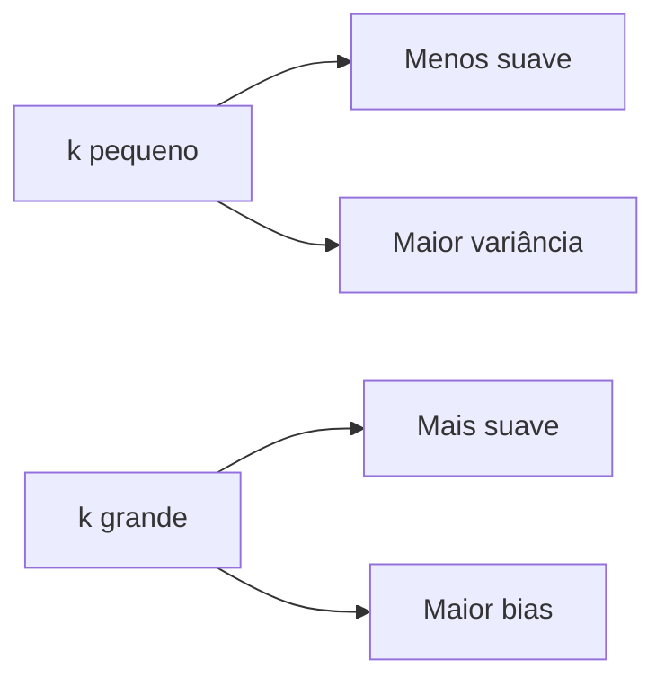

# 🎯 K-Nearest Neighbors (k-NN) para Regressão

## 📖 Definição
**k-NN** é um algoritmo **não paramétrico** e **lazy learning** que prediz valores baseado na média dos k vizinhos mais próximos no espaço de características.

## 🔧 Mecânica do Algoritmo

### 📐 Cálculo de Distância

$d(x_1, x_2) = \sqrt{\sum_{i=1}^{n} (x_{1i} - x_{2i})^2}$

### 🎯 Predição

$\hat{y} = \frac{1}{k} \sum_{i \in N_k(x_0)} y_i$

## ⚡ Características Principais

| Aspecto | ✅ Vantagem | ❌ Desvantagem |
|---------|-------------|----------------|
| **Simplicidade** | 🧠 Fácil de entender | 🎯 Limitado para padrões complexos |
| **Não Paramétrico** | 🔄 Adapta-se a qualquer forma | 💾 Usa toda memória disponível |
| **Lazy Learning** | ⚡ Sem treinamento | 🐌 Predição lenta |
| **Hiperparâmetro k** | 🎛️ Controle de suavidade | 🔍 Difícil escolha ótima |

## 🎛️ Efeito do Hiperparâmetro k

### 📊 Comportamento
- **k = 1**: Predição = valor do vizinho mais próximo
- **k = n**: Predição = média global (muito suave)
- **k ótimo**: Balanceia bias e variância

### 📈 Trade-off Suavidade vs. Precisão


## 🔍 Algoritmo Passo a Passo

1. **📏 Calcular distâncias** entre ponto de consulta e todos os pontos de treino
2. **🎯 Encontrar k vizinhos** com menores distâncias
3. **📊 Calcular média** dos valores y dos k vizinhos
4. **🎯 Retornar predição**

## 🚀 Complexidade

| Operação | Tempo | Espaço |
|----------|-------|--------|
| **Treinamento** | O(1) | O(n) |
| **Predição** | O(n) | O(1) |

## 🎯 Casos de Uso

### ✅ Ideal para:
- 📊 Dados com padrões locais
- 🔍 Exploração rápida de dados
- 🧪 Baseline simples

### ❌ Evitar quando:
- 📈 Dados de alta dimensionalidade
- ⚡ Predições em tempo real
- 💾 Memória limitada

## 🔧 Implementação Prática

### 📋 Validações Essenciais
```python
if k <= 0: raise ValueError("k deve ser positivo")
if k > n_samples: raise ValueError("k muito grande")
```

### 🎯 Otimizações Comuns
- **KD-Trees**: Para dados multidimensionais
- **Ball Trees**: Para métricas não euclidianas
- **Locality Sensitive Hashing**: Para datasets grandes

## 📚 Referências Teóricas
- **ESL Seção 2.3.2**: Fundamentos teóricos
- **Curse of Dimensionality**: Limitação em alta dimensão
- **Bias-Variance Trade-off**: Teoria de generalização 