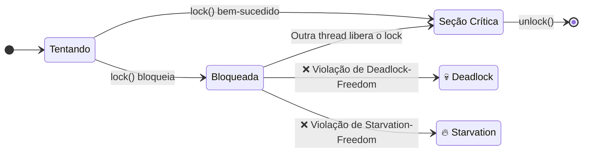
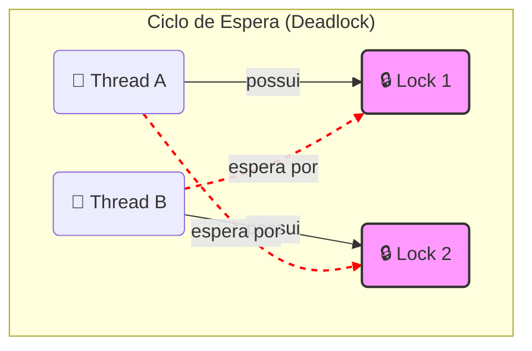
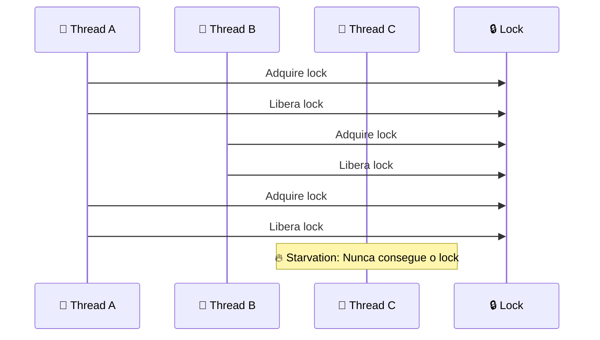

# 🛡️ Propriedades de Correção

## 🎯 Conceito Central

Algoritmos de exclusão mútua devem satisfazer três propriedades fundamentais: **mutual exclusion**, **deadlock-freedom** e **starvation-freedom**.

## 🎨 Diagrama de Estados das Propriedades



## 🎨 Diagrama de Deadlock (Filósofos Comilões)



## 📊 Propriedades Fundamentais

### 🔒 Mutual Exclusion
**Seções críticas de threads diferentes não se sobrepõem**

```
Para threads A e B, e inteiros j e k:
CS_A^j → CS_B^k OU CS_B^k → CS_A^j
```

- ✅ **Safety property**: Garante correção dos resultados
- ❌ **Sem mutual exclusion**: Race conditions e resultados incorretos

### 🚫 Deadlock-Freedom  
**Se alguma thread tenta adquirir o lock, alguma thread consegue**

```
Se thread A chama lock() mas nunca adquire:
→ Outras threads completam infinitas seções críticas
```

- ✅ **Liveness property**: Sistema nunca "congela"
- ⚠️ **Threads individuais**: Podem ficar presas (starvation)

### ⭐ Starvation-Freedom
**Toda thread que tenta adquirir o lock eventualmente consegue**

```
Toda chamada para lock() eventualmente retorna
```

- ✅ **Liveness property**: Garante progresso para todas as threads
- 🔗 **Implica deadlock-freedom**: Starvation-freedom → Deadlock-freedom

## 🎨 Diagrama de Starvation



## 📋 Hierarquia de Propriedades

| Propriedade | Força | Garantia |
|-------------|-------|----------|
| **Mutual Exclusion** | 🔴 Essencial | Correção dos resultados |
| **Deadlock-Freedom** | 🟡 Importante | Sistema não congela |
| **Starvation-Freedom** | 🟢 Desejável | Progresso para todas |

## ⚡ Exemplo: Deadlock com Múltiplos Locks

```java
// Thread A: lock0.lock() → lock1.lock()
// Thread B: lock1.lock() → lock0.lock()

// Resultado: Deadlock mesmo com locks deadlock-free
```

## 🔧 Análise Prática

### ✅ Algoritmos Práticos
- **Starvation-free**: Garantia forte, mas overhead
- **Deadlock-free**: Compromisso entre correção e performance
- **Apenas mutual exclusion**: Rápido, mas pode causar starvation

### 📊 Trade-offs

| Aspecto | Starvation-Free | Deadlock-Free | Mutual Exclusion |
|---------|----------------|---------------|------------------|
| **Correção** | ✅ Máxima | ✅ Básica | ✅ Básica |
| **Performance** | ⏰ Overhead | 🚀 Moderado | 🚀 Rápido |
| **Fairness** | ✅ Garantida | ❌ Não garantida | ❌ Não garantida |
| **Complexidade** | 🔥 Alta | 🟡 Média | 🟢 Baixa | 