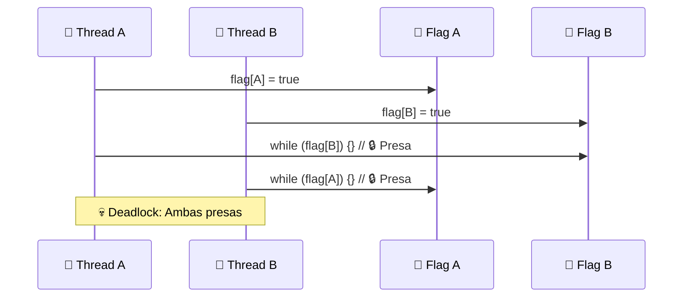
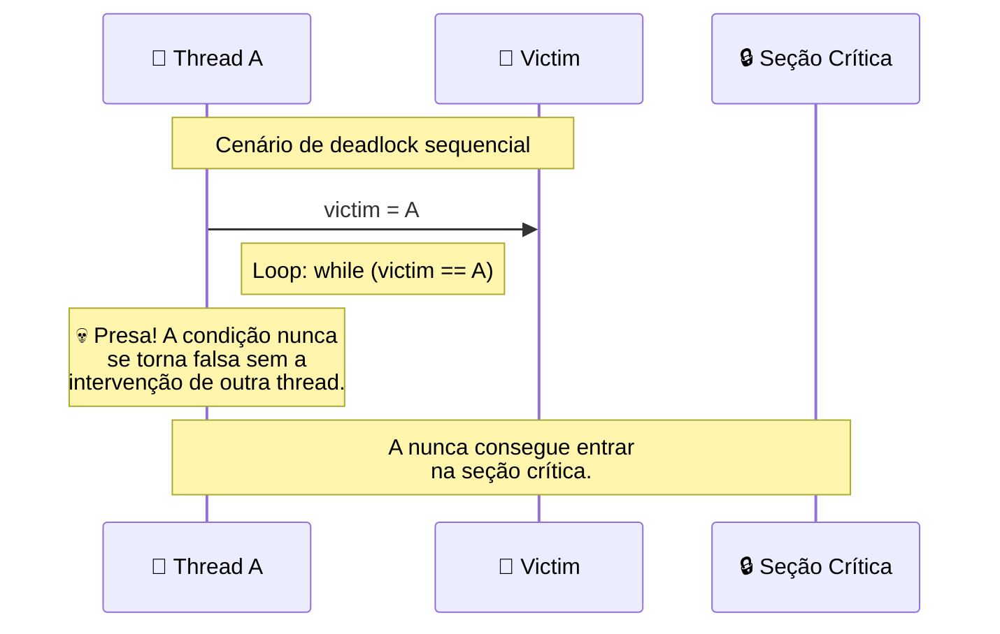

# 🔒 LockOne e LockTwo

## 🎯 Conceito Central

Dois algoritmos **inadequados mas interessantes** para 2 threads. Cada um funciona em cenários específicos onde o outro falha, demonstrando trade-offs fundamentais em exclusão mútua.

## 🎨 Diagrama de Deadlock no LockOne



## 📊 LockOne Algorithm

### 🔧 Implementação
```java
class LockOne {
    boolean[] flag = {false, false};
    
    void lock() {
        int i = ThreadID.get();
        int j = 1 - i;
        flag[i] = true;           // Indica interesse
        while (flag[j]) {}        // Aguarda outra desistir
    }
    
    void unlock() {
        int i = ThreadID.get();
        flag[i] = false;          // Desiste do lock
    }
}
```

### ✅ Propriedades
- **Mutual Exclusion**: ✅ Satisfaz
- **Deadlock-Freedom**: ❌ Pode deadlock
- **Starvation-Freedom**: ❌ Não garante

### ⚠️ Problema: Deadlock
```
Thread A: flag[A] = true
Thread B: flag[B] = true
Thread A: while (flag[B]) {}  // 🔒 Presa
Thread B: while (flag[A]) {}  // 🔒 Presa
```

## 🎨 Diagrama de Deadlock no LockTwo



## 📊 LockTwo Algorithm

### 🔧 Implementação
```java
class LockTwo {
    int victim = 0;
    
    void lock() {
        int i = ThreadID.get();
        victim = i;               // Deixa outra ir primeiro
        while (victim == i) {}    // Aguarda não ser vítima
    }
    
    void unlock() {
        // Não precisa fazer nada
    }
}
```

### ✅ Propriedades
- **Mutual Exclusion**: ✅ Satisfaz
- **Deadlock-Freedom**: ❌ Pode deadlock
- **Starvation-Freedom**: ❌ Não garante

### ⚠️ Problema: Deadlock Sequencial
```
Thread A executa completamente: victim = A
Thread B tenta entrar: victim = B
Thread A tenta novamente: victim = A
Thread B aguarda: while (victim == B) {}  // 🔒 Presa
```

## 📋 Comparação dos Algoritmos

| Aspecto | LockOne | LockTwo |
|---------|---------|---------|
| **Funciona quando** | 🔄 Threads sequenciais | 🔄 Threads concorrentes |
| **Falha quando** | 🔄 Threads concorrentes | 🔄 Threads sequenciais |
| **Complexidade** | 🟢 Simples | 🟢 Simples |
| **Overhead** | 🚀 Baixo | 🚀 Baixo |
| **Praticidade** | ❌ Limitada | ❌ Limitada |

## 🔧 Análise Teórica

### LockOne: Prova de Mutual Exclusion
```
Se CS_A^j || CS_B^k (concorrentes):
write_A(flag[A]=true) → read_A(flag[B]=false) → CS_A
write_B(flag[B]=true) → read_B(flag[A]=false) → CS_B
read_A(flag[B]=false) → write_B(flag[B]=true)

Contradição: flag[B] não pode ser false e true
```

### LockTwo: Prova de Mutual Exclusion
```
Se CS_A^j || CS_B^k (concorrentes):
write_A(victim=A) → read_A(victim=B) → CS_A
write_B(victim=B) → read_B(victim=A) → CS_B

Contradição: victim não pode ser A e B simultaneamente
```

## ⚡ Insights Fundamentais

- **Complementaridade**: Cada algoritmo funciona onde o outro falha
- **Trade-off**: Sequencial vs Concorrente
- **Motivação**: Necessidade de combinar abordagens
- **Próximo passo**: Algoritmo de Peterson combina ambos 