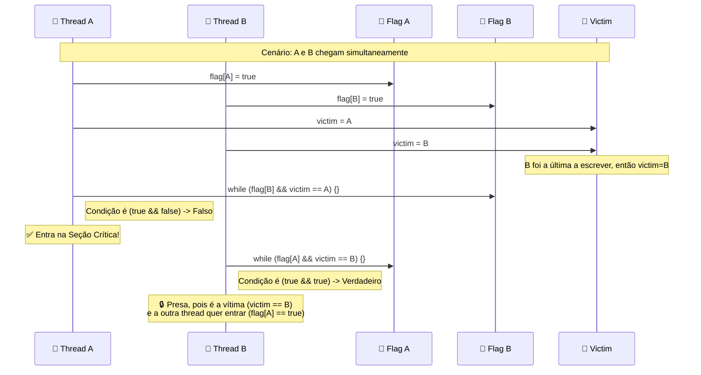
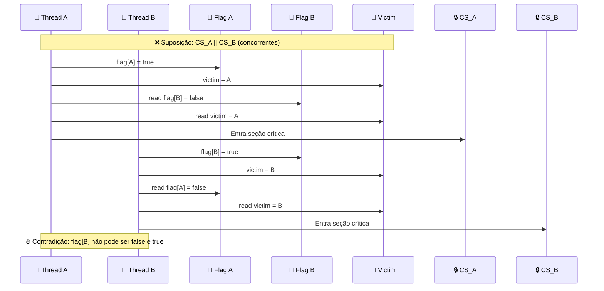

# 🔒 Algoritmo de Peterson

## 🎯 Conceito Central

**Algoritmo mais elegante** para 2 threads que combina LockOne e LockTwo. É **starvation-free** e considerado o padrão ouro para exclusão mútua entre 2 threads.

## 🎨 Diagrama de Funcionamento do Peterson



## 🔧 Implementação

```java
class PetersonLock {
    boolean[] flag = {false, false};
    int victim = 0;
    
    void lock() {
        int i = ThreadID.get();
        int j = 1 - i;
        
        flag[i] = true;                    // LockOne: indica interesse
        victim = i;                        // LockTwo: deixa outra ir primeiro
        
        while (flag[j] && victim == i) {}  // Combina ambas condições
    }
    
    void unlock() {
        int i = ThreadID.get();
        flag[i] = false;                   // Desiste do lock
    }
}
```

## ✅ Propriedades

| Propriedade | Status | Garantia |
|-------------|--------|----------|
| **Mutual Exclusion** | ✅ | Seções críticas não se sobrepõem |
| **Deadlock-Freedom** | ✅ | Sistema nunca congela |
| **Starvation-Freedom** | ✅ | Toda thread eventualmente consegue |

## 🔧 Análise da Condição de Espera

### Condição: `flag[j] && victim == i`

- **flag[j] = false**: Thread j desistiu → posso entrar
- **victim != i**: Não sou mais a vítima → posso entrar
- **Ambas true**: Thread j quer entrar E sou vítima → aguardo

### Por que Funciona?

1. **Se A e B chegam simultaneamente**:
   - A define victim = A, B define victim = B
   - Último a escrever "ganha" (victim final)
   - Perdedor aguarda até winner sair

2. **Se A chega antes de B**:
   - A define victim = A, entra na seção crítica
   - B define victim = B, aguarda A sair

## 🎨 Diagrama de Prova de Mutual Exclusion



## 📊 Prova de Mutual Exclusion

### Suponha CS_A^j || CS_B^k (concorrentes)

```
write_A(flag[A]=true) → write_A(victim=A) → read_A(flag[B]) → read_A(victim) → CS_A
write_B(flag[B]=true) → write_B(victim=B) → read_B(flag[A]) → read_B(victim) → CS_B
```

### Análise da Contradição

- Se A foi último a escrever victim: `write_B(victim=B) → write_A(victim=A)`
- A leu victim = A, então deve ter lido flag[B] = false
- Mas B escreveu flag[B] = true antes de escrever victim
- **Contradição**: flag[B] não pode ser false e true

## 📊 Prova de Starvation-Freedom

### Suponha A fica presa no lock()

- A aguarda: `flag[B] = false` OU `victim != A`
- Se B está na seção crítica: eventualmente define flag[B] = false
- Se B está no lock(): define victim = B, liberando A
- **Contradição**: A não pode ficar presa indefinidamente

## ⚡ Vantagens

- **Simplicidade**: Apenas 3 variáveis compartilhadas
- **Eficiência**: 2 writes + 2 reads para lock()
- **Correção**: Todas as propriedades desejadas
- **Elegância**: Combina ideias de LockOne e LockTwo

## 🔧 Implementação Python

```python
class PetersonLock:
    def __init__(self):
        self.flag = [False, False]
        self.victim = 0
        
    def lock(self):
        i = threading.current_thread().ident % 2
        j = 1 - i
        
        self.flag[i] = True
        self.victim = i
        
        while self.flag[j] and self.victim == i:
            pass
            
    def unlock(self):
        i = threading.current_thread().ident % 2
        self.flag[i] = False
```

## 📋 Comparação com Outros Algoritmos

| Aspecto | LockOne | LockTwo | Peterson |
|---------|---------|---------|----------|
| **Mutual Exclusion** | ✅ | ✅ | ✅ |
| **Deadlock-Freedom** | ❌ | ❌ | ✅ |
| **Starvation-Freedom** | ❌ | ❌ | ✅ |
| **Complexidade** | 🟢 Simples | 🟢 Simples | 🟢 Simples |
| **Praticidade** | ❌ Limitada | ❌ Limitada | ✅ Completa | 