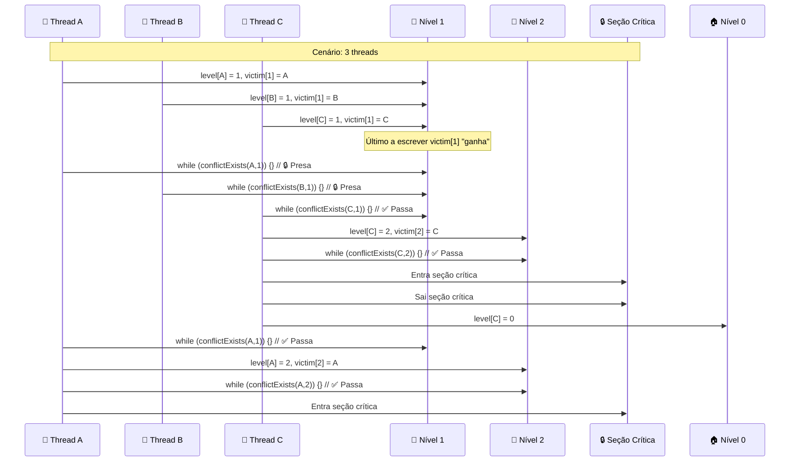
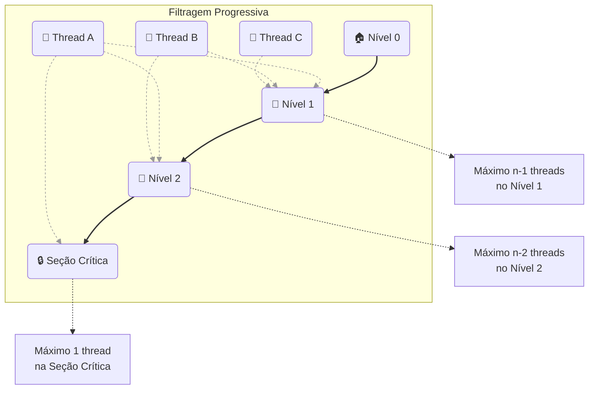

# 🔒 Filter Lock

## 🎯 Conceito Central

**Generalização do Peterson Lock** para n threads. Cria n-1 "salas de espera" (níveis) que threads devem atravessar antes de entrar na seção crítica. Cada nível filtra uma thread.

## 🎨 Diagrama de Funcionamento do Filter



## 🔧 Implementação

```java
class Filter {
    int[] level;
    int[] victim;
    
    void lock() {
        int me = ThreadID.get();
        
        for (int i = 1; i < n; i++) {
            level[me] = i;                    // Entra no nível i
            victim[i] = me;                   // Torna-se vítima
            
            while (conflictExists(me, i)) {}  // Aguarda conflitos
        }
    }
    
    void unlock() {
        int me = ThreadID.get();
        level[me] = 0;                        // Volta ao nível 0
    }
}
```

## 📊 Propriedades dos Níveis

### 🎯 Filtragem Progressiva
- **Nível 0**: n threads podem estar simultaneamente
- **Nível 1**: n-1 threads podem estar simultaneamente  
- **Nível 2**: n-2 threads podem estar simultaneamente
- **Nível n-1**: Apenas 1 thread (seção crítica)

### 🔧 Condição de Conflito
```java
boolean conflictExists(int me, int level) {
    for (int k = 0; k < n; k++) {
        if (k != me && level[k] >= level && victim[level] == me) {
            return true;  // Conflito existe
        }
    }
    return false;
}
```

## 🎨 Diagrama de Conflitos por Nível



## ✅ Propriedades

| Propriedade | Status | Garantia |
|-------------|--------|----------|
| **Mutual Exclusion** | ✅ | Apenas 1 thread na seção crítica |
| **Deadlock-Freedom** | ✅ | Sistema nunca congela |
| **Starvation-Freedom** | ✅ | Toda thread eventualmente consegue |

## 📊 Análise Teórica

### Lema: No máximo n-j threads no nível j

**Indução em j:**
- **Base (j=0)**: Trivial, n threads podem estar no nível 0
- **Indução**: Se n-j+1 threads no nível j-1, pelo menos 1 não progride para j

### Prova de Mutual Exclusion

- Seção crítica = nível n-1
- Máximo 1 thread no nível n-1
- **Conclusão**: Mutual exclusion garantida

### Prova de Starvation-Freedom

**Indução reversa nos níveis:**
- **Base**: Nível n-1 (apenas 1 thread)
- **Indução**: Se threads no nível j+1 eventualmente entram, threads no nível j também entram

## ⚡ Vantagens e Desvantagens

### ✅ Vantagens
- **Escalabilidade**: Funciona para qualquer n
- **Correção**: Todas as propriedades desejadas
- **Simplicidade**: Conceito intuitivo de níveis

### ❌ Desvantagens
- **Overhead**: O(n) operações por lock()
- **Memória**: O(n) variáveis compartilhadas
- **Latência**: Threads passam por todos os níveis

## 🔧 Implementação Python

```python
class FilterLock:
    def __init__(self, n):
        self.n = n
        self.level = [0] * n
        self.victim = [0] * n
        
    def lock(self):
        me = threading.current_thread().ident % self.n
        
        for i in range(1, self.n):
            self.level[me] = i
            self.victim[i] = me
            
            while self._conflict_exists(me, i):
                pass
                
    def unlock(self):
        me = threading.current_thread().ident % self.n
        self.level[me] = 0
        
    def _conflict_exists(self, me, level):
        for k in range(self.n):
            if k != me:
                if (self.level[k] >= level and 
                    self.victim[level] == me):
                    return True
        return False
```

## 📋 Comparação com Outros Algoritmos

| Aspecto | Peterson (2 threads) | Filter (n threads) |
|---------|----------------------|-------------------|
| **Mutual Exclusion** | ✅ | ✅ |
| **Deadlock-Freedom** | ✅ | ✅ |
| **Starvation-Freedom** | ✅ | ✅ |
| **Complexidade** | O(1) | O(n) |
| **Memória** | O(1) | O(n) |
| **Escalabilidade** | ❌ 2 threads | ✅ n threads |

## 🎯 Aplicações Práticas

- **Sistemas multiprocessador**: Coordenação entre múltiplas CPUs
- **Simulações paralelas**: Controle de acesso a recursos compartilhados
- **Algoritmos distribuídos**: Base para algoritmos mais complexos
- **Educação**: Demonstra conceitos fundamentais de concorrência 