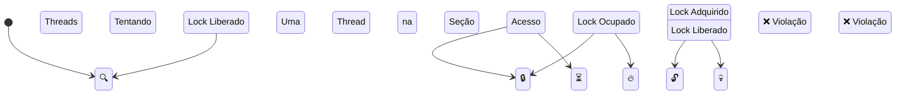

# 🔒 Mutual Exclusion

## 📋 Visão Geral

**Exclusão mútua** é a propriedade de segurança que garante que **seções críticas** — blocos de código que acessam recursos compartilhados — sejam executadas por **apenas uma thread por vez**. Sem ela, os resultados de uma computação podem ser incorretos devido a **condições de corrida**.

## 🎨 Diagrama Conceitual: Exclusão Mútua

## 📊 Problema das Condições de Corrida

| Cenário | ❌ Sem Proteção | ✅ Com Exclusão Mútua |
|---------|-----------------|----------------------|
| **Contador Compartilhado** | 🔥 Resultado incorreto | ✅ Resultado correto |
| **Acesso a Recursos** | 🔥 Corrupção de dados | ✅ Integridade garantida |
| **Ordem de Execução** | 🔥 Imprevisível | ✅ Controlada |

## 🎯 Objetivos de Aprendizado

- Compreender os conceitos fundamentais de exclusão mútua
- Analisar algoritmos clássicos (Peterson, Bakery, Filter)
- Entender propriedades de correção (mutual exclusion, deadlock-freedom, starvation-freedom)
- Compreender limitações teóricas dos algoritmos baseados em read/write

## 📚 Conteúdo

### 01. Conceitos Fundamentais
- [Tempo e Eventos](./01. Tempo e Eventos.md)
- [Seções Críticas](./02. Seções Críticas.md)
- [Propriedades de Correção](./03. Propriedades de Correção.md)

### 02. Algoritmos para 2 Threads
- [LockOne e LockTwo](./04. LockOne e LockTwo.md)
- [Algoritmo de Peterson](./05. Algoritmo de Peterson.md)

### 03. Algoritmos para N Threads
- [Filter Lock](./06. Filter Lock.md)
- [Bakery Algorithm](./07. Bakery Algorithm.md)

### 04. Mecanismos Práticos
- [Mecanismos de Exclusão Mútua](./08. Mecanismos de Exclusão Mútua.md)

### 05. Conceitos Avançados
- [Fairness](./08. Fairness.md)
- [Bounded Timestamps](./09. Bounded Timestamps.md)
- [Lower Bounds](./10. Lower Bounds.md)

## 🔧 Implementações

Os algoritmos estão implementados em `algorithms/mutual_exclusion/` com testes correspondentes. 