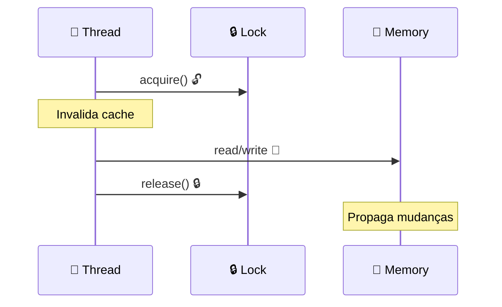
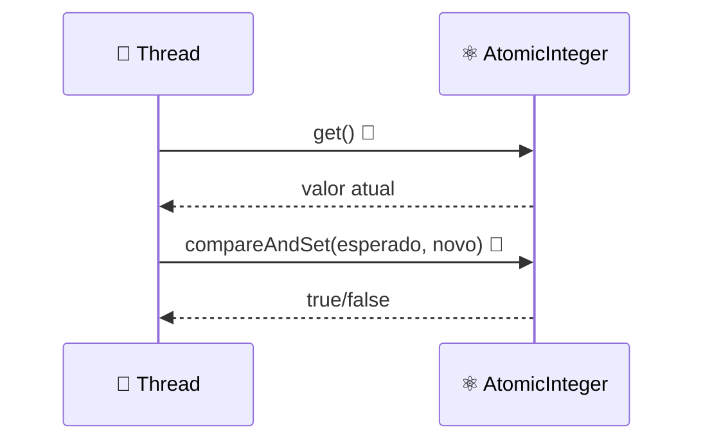

# ☕ Modelo de Memória Java

## 🔍 Por que não Linearizabilidade?

### ⚠️ Problema
- **Compiladores reordenam** reads/writes para otimização
- **Exemplo**: Register allocation, common subexpression elimination
- **Consequência**: Sequential consistency violada

### 🎯 Solução
- **Relaxed memory model** com regras específicas
- **Fundamental Property**: Se programa SC segue regras, execução é SC
- **Trade-off**: Performance vs correção

## 🔒 Locks e Synchronized Blocks

### 📋 Comportamento
- **Acquire lock**: Invalida working memory
- **Release lock**: Escreve mudanças para shared memory
- **Resultado**: Reads/writes protegidos são linearizáveis

### 🎨 Diagrama: Sincronização


## ⚡ Volatile Fields

### 📋 Propriedades
- **Read**: Como acquire lock (invalida cache)
- **Write**: Como release lock (propaga imediatamente)
- **Limitação**: Não são atômicos para operações compostas

### ⚠️ Exemplo Problemático
```java
volatile int x;
x++; // Não é atômico!
// Equivale a: temp = x; temp++; x = temp;
```

### ✅ Uso Correto
```java
volatile boolean flag; // Um thread escreve, outros leem
volatile AtomicInteger counter; // Operações atômicas
```

## 🛡️ Final Fields

### 📋 Regras
- **Inicialização**: No construtor
- **Visibilidade**: Sem sincronização (se regras seguidas)
- **Restrição**: `this` não pode escapar do construtor

### ✅ Exemplo Correto
```java
public class SafeObject {
    final int x = 42; // Sempre visível como 42
    int y = 100;      // Pode não ser visível
}
```

### ❌ Exemplo Incorreto
```java
public class UnsafeObject {
    final int x;
    
    public UnsafeObject(EventSource source) {
        source.register(this); // this escapa!
        this.x = 42;          // x pode não ser 42
    }
}
```

## 📊 Atomic Classes

### 📋 java.util.concurrent.atomic
- **AtomicReference<T>**: Referência atômica
- **AtomicInteger**: Inteiro atômico
- **Métodos**: `get()`, `set()`, `compareAndSet()`

### 🎨 Diagrama: Operações Atômicas


## 🔧 Regras para Sequential Consistency

### 📋 Condições
1. **Todos os reads/writes** são volatile, OU
2. **Todos os reads/writes** protegidos pelo mesmo lock

### 🎯 Exemplo Prático
```java
class ThreadSafeCounter {
    private volatile int count = 0;
    
    public void increment() {
        count++; // Não é atômico!
    }
    
    public synchronized void safeIncrement() {
        count++; // Atômico e SC
    }
}
```

## 📊 Comparação de Sincronização

| Método | 🎯 Atomicidade | ⚡ Performance | 🧠 Simplicidade |
|--------|----------------|---------------|-----------------|
| **Synchronized** | ✅ Completa | 🐌 Lenta | ✅ Simples |
| **Volatile** | ❌ Parcial | 📊 Média | ⚠️ Cuidado |
| **Atomic** | ✅ Completa | 📊 Média | ✅ Simples |
| **Final** | ✅ Imutável | 🚀 Rápida | ✅ Simples |

## 🎯 Boas Práticas

### ✅ Recomendações
- **Imutabilidade**: Use final fields quando possível
- **Atomic classes**: Para contadores e flags
- **Synchronized**: Para operações complexas
- **Volatile**: Apenas para flags simples

### ❌ Evitar
- **Double-checked locking**: Sempre incorreto
- **Volatile para operações compostas**: Use atomic
- **Escape de this no construtor**: Quebra final fields 