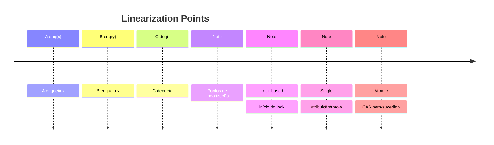

# 🔧 Implementações Práticas

## 🔒 Lock-Based FIFO Queue

### 📋 Implementação
```java
public class LockBasedQueue<T> {
    private final T[] items;
    private int head, tail;
    private final Lock lock = new ReentrantLock();
    
    public void enq(T item) {
        lock.lock();
        try {
            if (tail - head == items.length) 
                throw new FullException();
            items[tail % items.length] = item;
            tail++;
        } finally {
            lock.unlock();
        }
    }
    
    public T deq() {
        lock.lock();
        try {
            if (head == tail) 
                throw new EmptyException();
            T item = items[head % items.length];
            head++;
            return item;
        } finally {
            lock.unlock();
        }
    }
}
```

### 🎯 Linearization Points
- **enq()**: `lock.lock()` (início da critical section)
- **deq()**: `lock.lock()` (início da critical section)

## 🚀 Single-Enqueuer/Single-Dequeuer Queue

### 📋 Implementação
```java
public class SingleQueue<T> {
    private final T[] items;
    private int head, tail;
    
    public void enq(T item) {
        items[tail % items.length] = item;
        tail++;
    }
    
    public T deq() {
        if (head == tail) 
            throw new EmptyException();
        T item = items[head % items.length];
        head++;
        return item;
    }
}
```

### 🎯 Linearization Points
- **enq()**: Atribuição `items[tail] = item`
- **deq()**: `throw EmptyException` OU atribuição `head++`

## ⚛️ Atomic Counter

### 📋 Implementação
```java
public class AtomicCounter {
    private final AtomicInteger count = new AtomicInteger(0);
    
    public int getAndIncrement() {
        while (true) {
            int current = count.get();
            if (count.compareAndSet(current, current + 1))
                return current;
        }
    }
    
    public int get() {
        return count.get();
    }
}
```

### 🎯 Linearization Points
- **get()**: `count.get()`
- **getAndIncrement()**: `count.compareAndSet()` bem-sucedido

## 📊 Comparação de Implementações

| Implementação | 🎯 Linearização | ⚡ Performance | 🔒 Bloqueio |
|---------------|-----------------|---------------|-------------|
| **Lock-Based** | ✅ Simples | 🐌 Lenta | 🔒 Bloqueante |
| **Single Queue** | ⚡ Dinâmica | 🚀 Rápida | 🚫 Wait-free |
| **Atomic Counter** | ⚛️ Atômica | 📊 Média | 🚫 Lock-free |

## 🎨 Diagrama: Linearization Points



## 🔧 Padrões de Implementação

### 🎯 Lock-Based
- **Vantagem**: Simples de implementar
- **Desvantagem**: Bloqueante
- **Uso**: Operações complexas, baixa concorrência

### 🚀 Non-Blocking
- **Vantagem**: Alta performance
- **Desvantagem**: Complexo de implementar
- **Uso**: Operações simples, alta concorrência

### ⚛️ Atomic
- **Vantagem**: Balanceado
- **Desvantagem**: Limitado a operações simples
- **Uso**: Contadores, flags, referências

## 🎯 Escolha da Implementação

### 📋 Critérios
| Critério | 🔒 Lock-Based | 🚀 Non-Blocking | ⚛️ Atomic |
|----------|---------------|-----------------|-----------|
| **Simplicidade** | ✅ Alta | ❌ Baixa | 📊 Média |
| **Performance** | 🐌 Baixa | 🚀 Alta | 📊 Média |
| **Concorrência** | 🔒 Limitada | ⚡ Alta | 📊 Média |
| **Flexibilidade** | ✅ Alta | ❌ Baixa | ⚠️ Limitada |

### 🎯 Recomendações
- **Prototipagem**: Lock-based
- **Produção crítica**: Non-blocking
- **Operações simples**: Atomic
- **Sistemas legados**: Lock-based 